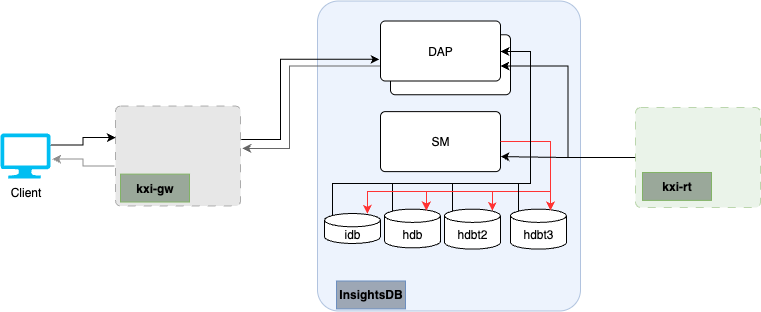

# kxi-db Chart

## Description

This chart deploys the Insights Database components to allow a client to ingest and persist data. This chart deploys independently with the sole function of persisting data. Access to the data is typically via the [Insights Gateway chart](../kxi-gw) which due to different scaling characteristics is typically deployed independently.



## Running

### Prerequisites

1. A working Kubernetes cluster with appropriate access to deploy applications
1. A Distributed storage solution offering RWM access level. (Kubernetes docs for more [here](https://kubernetes.io/docs/concepts/storage/persistent-volumes/#access-modes))
1. `helm` command installed on your local machine
1. Authentication details to Kx image repositories

  ```bash
  KX_USER=....
  KX_PASS=....
  KX_REGISTRY="portal.dl.kx.com"
  NAMESPACE="kxi-sdk"
  ```

1. `imagePullSecrets` setup on your cluster

  ```bash
  kubectl create secret docker-registry kx-pull-secret --docker-username=$KX_USER --docker-password=$KX_PASS --docker-server=$KX_REGISTRY -n $NAMESPACE

  ```

1. A license secret

  _Contact KX to get a license_

  ```bash
  LIC_FILE=./kc.lic
  kubectl create secret generic kx-license --from-file=license=$LIC_FILE -n $NAMESPACE
  ```

1. A deployment specific values file (`myvalues.yaml`) with configurations relative to your deployment. Available configurations are documented in the chart. This can be displayed by running

  ```bash
  # Run from kxCharts/kxi-db directory
  helm show values .
  ```

  A minimum `myvalues.yaml` configuration would contain

  ```yaml
  imagePullSecrets:
  - name: kx-pull-secret
  
  # You must set your license name. Default is 'kc.lic'
  # Available types are:
  #  - kc.lic
  #  - k4.lic
  #  - kx.lic
  kxLicenseName: kc.lic

  db:
    # Intraday persistent storage configuration
    idb:
      # Defines the storageClassNames for all the persistent data storage in the InsightsDB
      # This should map to Kubernetes storageClassNames with accessMode of RWM
      # More info: https://kubernetes.io/docs/concepts/storage/persistent-volumes/#access-modes
      storageClassName: "fsx-lustre"
      # Size of the Intraday persistent storage
      size: "2Gi"
    # HDB Tier 1 persistent storage configuration
    hdbt1:
      # Defines the storageClassNames for all the persistent data storage in the InsightsDB
      # This should map to Kubernetes storageClassNames with accessMode of RWM
      # More info: https://kubernetes.io/docs/concepts/storage/persistent-volumes/#access-modes
      storageClassName: "fsx-lustre"
      # Size of the HDB Tier 1 persistent storage
      size: "2Gi"
    # HDB Tier 2 persistent storage configuration
    hdbt2:
      # Defines the storageClassNames for all the persistent data storage in the InsightsDB
      # This should map to Kubernetes storageClassNames with accessMode of RWM
      # More info: https://kubernetes.io/docs/concepts/storage/persistent-volumes/#access-modes
      storageClassName: "fsx-lustre"
      # Size of the HDB Tier 2 persistent storage
      size: "2Gi"
    # HDB Tier 3 persistent storage configuration
    hdbt3:
      # Defines the storageClassNames for all the persistent data storage in the InsightsDB
      # This should map to Kubernetes storageClassNames with accessMode of RWM
      # More info: https://kubernetes.io/docs/concepts/storage/persistent-volumes/#access-modes
      storageClassName: "fsx-lustre"
      # Size of the HDB Tier 3 persistent storage
      size: "2Gi"

  kxiDa:
    # This should map to the resource coordinator svc deployed with the kxi-gw chart
    # Typically naming convention is '{Chart.name}-kxi-gw-rc', but if the {Chart.name} is 'kxi-gw' it will remove the duplication
    rcAddr: "kxi-gw-rc:5040"
  ```

### Deploying

```bash
# Run from '.../kxCharts/kxi-db' directory
RELEASENAME=kxi-db # Unique name for this deployment
VALUESFILE=myvalues.yaml
helm install $RELEASENAME . -f $VALUESFILE -n $NAMESPACE
```

### Upgrading/updating config

Upgrading and updating configuration are executed using `helm upgrade`. This will deploy any changes made to the charts or configuration since the last deploy and automatically redeploy the latest to the application

```bash
helm upgrade $RELEASENAME . -f $VALUESFILE -n $NAMESPACE
```

## Deploying your own database

The instructions above deploy a minimal database with a trade table defined in the [assembly.yaml](assembly.yaml). When you're ready to deploy your own database with your own schemas, you can provide your own yaml file.

1. Create your own assembly file `myassembly.yaml` in base directory of the `kxi-db` chart. Full info on creating database configurations [here](https://code.kx.com/insights/microservices/database/configuration/assembly/database.html)
1. Update your `myvalues.yaml` to define the database configuration you wish to deploy
    ```
    ...
    assembly:
      filename: myassembly.yaml
    ...
    ```
1. Deploy your database as normal detailed [here](#deploying).
