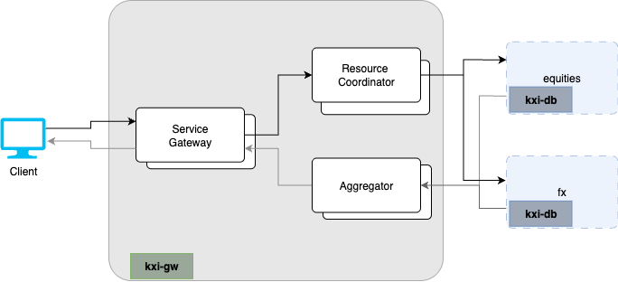

# kxi-gw Chart

## Description

This chart deploys the Insights Gateway components to allow a client to query [InsightsDBs](../kxi-db). This chart is deployed independent of InsightsDB to allow it to scale independently and incorporate many InsightsDB chart databases or database shards.



## Running on Kubernetes

### Prerequisites

1. A working Kubernetes cluster with appropriate access to deploy applications
1. `helm` command installed on your local machine
1. Authentication details to Kx image repositories

    ```bash
    KX_USER=....
    KX_PASS=....
    KX_REGISTRY="portal.dl.kx.com"
    NAMESPACE="kxi-sdk"
    ```

1. `imagePullSecrets` setup on your cluster

    ```bash
    kubectl create secret docker-registry kx-pull-secret --docker-username=$KX_USER --docker-password=$KX_PASS --docker-server=$KX_REGISTRY -n $NAMESPACE
    ```

1. A license secret

   _Contact KX to get a license_

    ```bash
    LIC_FILE=./kc.lic
    kubectl create secret generic kx-license --from-file=license=$LIC_FILE -n $NAMESPACE
    ```

1. A deployment specific values file (`myvalues.yaml`) with configurations relative to your deployment. Available configurations are documented in the chart. This can be displayed by running

    ```bash
    # Run from kxCharts/kxi-gw directory
    helm show values .
    ```

   A minimum `myvalues.yaml` configuration would contain

    ```yaml
    imagePullSecrets:
    - name: kx-pull-secret
    
    # You must set your license name. Default is 'kc.lic'
    # Available types are:
    #  - kc.lic
    #  - k4.lic
    #  - kx.lic
    kxLicenseName: kc.lic
    ```

### Deploying

```bash
# Run from '.../kxCharts/kxi-gw' directory
RELEASENAME=kxi-gw # Unique name for this deployment
VALUESFILE=myvalues.yaml
helm install $RELEASENAME . -f $VALUESFILE -n $NAMESPACE
```

### Upgrading/updating config

Upgrading and updating configuration are executed using `helm upgrade`. This will deploy any changes made to the charts or configuration since the last deploy and automatically redeploy the latest to the application

```bash
helm upgrade $RELEASENAME . -f $VALUESFILE -n $NAMESPACE
```
