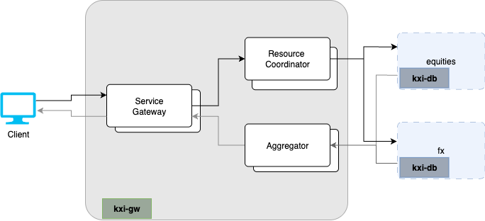

# kxi-gw Chart

## Description

This chart deploys the Insights Gateway components to allow a client to query [InsightsDBs](../kxi-db). This chart is deployed independent of InsightsDB to allow it to scale independently and incorporate many InsightsDB chart databases or database shards.



## Running on Kubernetes

### Prerequisites

1. A working Kubernetes cluster with appropriate access to deploy applications
1. `helm` command installed on your local machine
1. Authentication details to Kx image repositories

    ```bash
    KX_USER=....
    KX_PASS=....
    KX_REGISTRY="portal.dl.kx.com"
    NAMESPACE="kxi-sdk"
    ```

1. `imagePullSecrets` setup on your cluster

    ```bash
    kubectl create secret docker-registry kx-pull-secret --docker-username=$KX_USER --docker-password=$KX_PASS --docker-server=$KX_REGISTRY -n $NAMESPACE
    ```

1. A license secret

   _Contact KX to get a license_

    ```bash
    LIC_FILE=./kc.lic
    kubectl create secret generic kx-license --from-file=license=$LIC_FILE -n $NAMESPACE
    ```

1. A deployment specific values file (`myvalues.yaml`) with configurations relative to your deployment. Available configurations are documented in the chart. This can be displayed by running

    ```bash
    # Run from kxCharts/kxi-gw directory
    helm show values .
    ```

   A minimum `myvalues.yaml` configuration would contain

    ```yaml
    imagePullSecrets:
    - name: kx-pull-secret

    # -- You must set your license name. Default is `"kc.lic"`.
    # Available types are:
    #  - `"kc.lic"`
    #  - `"k4.lic"`
    #  - `"kx.lic"`
    kxLicenseName: "kc.lic"
    ```

### Deploying

```bash
# Run from '.../kxCharts/kxi-gw' directory
RELEASENAME=kxi-gw # Unique name for this deployment
VALUESFILE=myvalues.yaml
helm install $RELEASENAME . -f $VALUESFILE -n $NAMESPACE
```

### Upgrading/updating config

Upgrading and updating configuration are executed using `helm upgrade`. This will deploy any changes made to the charts or configuration since the last deploy and automatically redeploy the latest to the application

```bash
helm upgrade $RELEASENAME . -f $VALUESFILE -n $NAMESPACE
```

## Configuration Options

### Local Configurations

Local values configuration for `kxi-gw`.

| Key | Type | Default | Description |
|-----|------|---------|-------------|
| `fullnameOverride` | `string` | <code>""</code> | This sets the full name of the InsightsGW deployment.<br>Override the default fully qualified app name.<br>By default resources are named using `<.Release.Name>-<.Chart.Name>`.<br>Used when generating resource names. |
| `image` | `object` | <code>{}</code> | Default image repository and pull settings for Insights Gateway chart components.<br>Refer to [Images](https://kubernetes.io/docs/concepts/containers/images/). |
| `image.pullPolicy` | `string` | <code>"IfNotPresent"</code> | Image pull policy.<br>Refer to [Image Pull Policy](https://kubernetes.io/docs/concepts/containers/images/#image-pull-policy). |
| `image.repository` | `string` | <code>"portal.dl.kx.com/"</code> | Image repository. |
| `imagePullSecrets` | `list` | <code>[]</code> | Image pull secrets to be applied to all pods within the chart.<br>For pulling an image from a private repository.<br>Refer to [Image Pull Secrets](https://kubernetes.io/docs/tasks/configure-pod-container/pull-image-private-registry/). |
| `kxLicenseName` | `string` | <code>"kc.lic"</code> | You must set your license name.<br>Available types are:  - `"kc.lic"`  - `"k4.lic"`  - `"kx.lic"` |
| `kxiAgg.affinity` | `object` | <code>{}</code> | Allows adding affinities to the Aggregator.<br>Refer to [Pod Affinity](https://kubernetes.io/docs/concepts/scheduling-eviction/assign-pod-node/#affinity-and-anti-affinity). |
| `kxiAgg.args` | `list` | <code>[]</code> | Can provide any valid `q` runtime argument here.<br>Full details [here](https://code.kx.com/q/basics/cmdline/).<br>**NOTE** the `-p` argument will be overridden by the `KXI_PORT` env variable. |
| `kxiAgg.customCode` | `object` | <code>{}</code> | Allows for custom code to be loaded into the Aggregator specifically for UDAs typically deployed in a kxi-db chart.<br>More information can be found [here](https://code.kx.com/insights/1.15/microservices/database/configuration/uda.html#load-uda). |
| `kxiAgg.customCode.configMap` | `string` | <code>""</code> | If `customCode.configMap` is populated there should be a `configMap` deployed by that name and it will be mounted into the Aggregator. |
| `kxiAgg.customCode.entry` | `string` | <code>""</code> | The entrypoint should be the name of the file which is executed to load the custom code. |
| `kxiAgg.envs` | `list` | <code>[<br/>&nbsp;&nbsp;{<br/>&nbsp;&nbsp;&nbsp;&nbsp;"name": "KXI_LOG_FORMAT",<br/>&nbsp;&nbsp;&nbsp;&nbsp;"value": "text"<br/>&nbsp;&nbsp;},<br/>&nbsp;&nbsp;{<br/>&nbsp;&nbsp;&nbsp;&nbsp;"name": "KXI_LOG_LEVELS",<br/>&nbsp;&nbsp;&nbsp;&nbsp;"value": "default:debug"<br/>&nbsp;&nbsp;}<br/>]</code> | Default common environment variables for the Aggregator.<br>Additional ENVs can be added and these overridden in custom values files.<br>If overriding `envs`, ensure you include all the default values. |
| `kxiAgg.image` | `object` | <code>{}</code> | This sets overriding container image information.<br>Use if you wish to target specific versions of the Agg.<br>More information can be found [here](https://kubernetes.io/docs/concepts/containers/images/). |
| `kxiAgg.image.tag` | `string` | <code>""</code> | Image tag. |
| `kxiAgg.nodeSelector` | `object` | <code>{}</code> | Allows adding node selector constraints to the Aggregator.<br>This constrains the pods to run only on nodes that match the specified labels.<br>Dictionary of key-value pairs.<br>Refer to [NodeSelector](https://kubernetes.io/docs/concepts/scheduling-eviction/assign-pod-node/#nodeselector). |
| `kxiAgg.podAnnotations` | `object` | <code>{}</code> | This is for setting Kubernetes Annotations to a Pod.<br>Dictionary of key-value pairs.<br>Refer to [Object Annotations](https://kubernetes.io/docs/concepts/overview/working-with-objects/annotations/). |
| `kxiAgg.podLabels` | `object` | <code>{}</code> | This is for setting Kubernetes Labels to a Pod.<br>Dictionary of key-value pairs.<br>Refer to [Object Labels](https://kubernetes.io/docs/concepts/overview/working-with-objects/labels/). |
| `kxiAgg.replicaCount` | `int` | <code>1</code> | This sets the number of replicas for the Aggregator.<br>More information can be found [here](https://kubernetes.io/docs/concepts/workloads/controllers/deployment/#replicas-and-scaling). |
| `kxiAgg.resources` | `object` | <code>{}</code> | Aggregator Kubernetes resources.<br>Refer to [Container Resources](https://kubernetes.io/docs/concepts/configuration/manage-resources-containers/). |
| `kxiAgg.service` | `object` | <code>{}</code> | This is for setting up an Aggregator service.<br>More information can be found [here](https://kubernetes.io/docs/concepts/services-networking/service/). |
| `kxiAgg.service.annotations` | `object` | <code>{}</code> | This sets the service annotations for the Aggregator.<br>Dictionary of key-value pairs.<br>Refer to [Object Annotations](https://kubernetes.io/docs/concepts/overview/working-with-objects/annotations/). |
| `kxiAgg.service.port` | `int` | <code>5060</code> | Set exposed Service Port.<br>Refer to [Service Ports](https://kubernetes.io/docs/concepts/services-networking/service/#field-spec-ports). |
| `kxiAgg.service.type` | `string` | <code>"ClusterIP"</code> | Sets the Service type.<br>Refer to [Service Types](https://kubernetes.io/docs/concepts/services-networking/service/#publishing-services-service-types). |
| `kxiAgg.tolerations` | `list` | <code>[]</code> | Allows adding tolerations to the Aggregator.<br>This allows the pods to be scheduled on nodes with matching taints.<br>Refer to [Taint and Tolerations](https://kubernetes.io/docs/concepts/scheduling-eviction/taint-and-toleration/). |
| `kxiAgg.volumeMounts` | `list` | <code>[]</code> | Allows additional `volumeMounts` to be added to the Aggregator. |
| `kxiAgg.volumes` | `list` | <code>[]</code> | Allows additional `volumes` to be added to the Aggregator. |
| `kxiRc.affinity` | `object` | <code>{}</code> | Allows adding affinities to the Resource Coordinator.<br>Refer to [Pod Affinity](https://kubernetes.io/docs/concepts/scheduling-eviction/assign-pod-node/#affinity-and-anti-affinity). |
| `kxiRc.allowedSbxApis` | `string` | <code>".kxi.sql,.kxi.qsql,.kxi.sql2"</code> | Sets the available free string queries available for the RC.<br> Each has security and performance implications.<br>More information can be found [here](https://code.kx.com/insights/api/kxi-python/query.html#qsql). |
| `kxiRc.args` | `list` | <code>[]</code> | Can provide any valid `q` runtime argument here.<br>Full details [here](https://code.kx.com/q/basics/cmdline/).<br>**NOTE** the '-p' argument will be overridden by the `KXI_PORT` env variable. |
| `kxiRc.envs` | `list` | <code>[<br/>&nbsp;&nbsp;{<br/>&nbsp;&nbsp;&nbsp;&nbsp;"name": "KXI_LOG_FORMAT",<br/>&nbsp;&nbsp;&nbsp;&nbsp;"value": "text"<br/>&nbsp;&nbsp;},<br/>&nbsp;&nbsp;{<br/>&nbsp;&nbsp;&nbsp;&nbsp;"name": "KXI_LOG_LEVELS",<br/>&nbsp;&nbsp;&nbsp;&nbsp;"value": "default:debug"<br/>&nbsp;&nbsp;}<br/>]</code> | Default common environment variables for the Resource Coordinator.<br>Additional ENVs can be added and these overridden in custom values files.<br>If overriding `envs`, ensure you include all the default values. |
| `kxiRc.image` | `object` | <code>{}</code> | This sets overriding container image information.<br>Use if you wish to target specific versions of the RC.<br>More information can be found [here](https://kubernetes.io/docs/concepts/containers/images/). |
| `kxiRc.image.tag` | `string` | <code>""</code> | Image tag. |
| `kxiRc.nodeSelector` | `object` | <code>{}</code> | Allows adding node selector constraints to a Pod.<br>This constrains the pods to run only on nodes that match the specified labels.<br>Dictionary of key-value pairs.<br>Refer to [NodeSelector](https://kubernetes.io/docs/concepts/scheduling-eviction/assign-pod-node/#nodeselector). |
| `kxiRc.podAnnotations` | `object` | <code>{}</code> | Custom annotations to be applied to Pod resources.<br>Dictionary of key-value pairs.<br>Refer to [Object Annotations](https://kubernetes.io/docs/concepts/overview/working-with-objects/annotations/). |
| `kxiRc.podLabels` | `object` | <code>{}</code> | Custom labels to be applied to Pod resources.<br>Dictionary of key-value pairs.<br>Refer to [Object Labels](https://kubernetes.io/docs/concepts/overview/working-with-objects/labels/). |
| `kxiRc.resources` | `object` | <code>{}</code> | Resource Coordinator Kubernetes resources.<br>Refer to [Container Resources](https://kubernetes.io/docs/concepts/configuration/manage-resources-containers/). |
| `kxiRc.service` | `object` | <code>{}</code> | Provisions the Kubernetes Service required to expose the workloads.<br>More information can be found [here](https://kubernetes.io/docs/concepts/services-networking/service/). |
| `kxiRc.service.port` | `int` | <code>5040</code> | Set exposed Service Port.<br>Refer to [Service Ports](https://kubernetes.io/docs/concepts/services-networking/service/#field-spec-ports). |
| `kxiRc.service.type` | `string` | <code>"ClusterIP"</code> | This sets the Service type.<br>Setting the type field to `LoadBalancer` provisions a load balancer for your Service.<br>The actual creation of the load balancer happens asynchronously, and information about the provisioned balancer is published in the Service's `.status.loadBalancer`.<br>More information can be found [here](https://kubernetes.io/docs/concepts/services-networking/service/#publishing-services-service-types). |
| `kxiRc.tolerations` | `list` | <code>[]</code> | This is for setting Kubernetes Tolerations to a Pod.<br>This allows the pods to be scheduled on nodes with matching taints.<br>Refer to [Taint and Tolerations](https://kubernetes.io/docs/concepts/scheduling-eviction/taint-and-toleration/). |
| `kxiRc.volumeMounts` | `list` | <code>[]</code> | Allows additional `volumeMounts` to be added to the Resource Coordinator.<br>Refer to [Volumes](https://kubernetes.io/docs/concepts/storage/volumes/). |
| `kxiRc.volumes` | `list` | <code>[]</code> | Allows additional `volumes` to be added to the Resource Coordinator.<br>Refer to [Volumes](https://kubernetes.io/docs/concepts/storage/volumes/). |
| `kxiSg.affinity` | `object` | <code>{}</code> | Allows adding affinities to the Service Gateway.<br>Refer to [Pod Affinity](https://kubernetes.io/docs/concepts/scheduling-eviction/assign-pod-node/#affinity-and-anti-affinity). |
| `kxiSg.customIpcAuth` | `object` | <code>{}</code> | Custom IPC Authorization configuration.<br>Configure the `customIpcAuth` section to enable custom authentication for an IPC connection to the Service Gateway.<br>More information can be found [here](https://code.kx.com/insights/microservices/database/configuration/advanced/custom-auth-ipc.html). |
| `kxiSg.customIpcAuth.enabled` | `bool` | <code>false</code> | Enable/disable custom IPC authorization sidecar. |
| `kxiSg.customIpcAuth.sidecar.authApi` | `string` | <code>"authorize"</code> | Custom authorization function name (defaults to `"authorize"`). |
| `kxiSg.customIpcAuth.sidecar.envs` | `list` | <code>[<br/>&nbsp;&nbsp;{<br/>&nbsp;&nbsp;&nbsp;&nbsp;"name": "QLIC",<br/>&nbsp;&nbsp;&nbsp;&nbsp;"value": "/opt/kx/lic"<br/>&nbsp;&nbsp;}<br/>]</code> | Additional environment variables for the authorization sidecar. |
| `kxiSg.customIpcAuth.sidecar.image` | `object` | <code>{}</code> | Container image for the custom authorization sidecar. |
| `kxiSg.customIpcAuth.sidecar.image.name` | `string` | <code>""</code> | The name of the custom authentication sidecar image. |
| `kxiSg.customIpcAuth.sidecar.image.pullPolicy` | `string` | <code>"IfNotPresent"</code> | Image pull policy.<br>Refer to [Image Pull Policy](https://kubernetes.io/docs/concepts/containers/images/#image-pull-policy). |
| `kxiSg.customIpcAuth.sidecar.image.repository` | `string` | <code>"portal.dl.kx.com/"</code> | Where the custom authentication sidecar image is located. |
| `kxiSg.customIpcAuth.sidecar.image.tag` | `string` | <code>""</code> | The tag of the custom authentication sidecar image. |
| `kxiSg.customIpcAuth.sidecar.port` | `int` | <code>5000</code> | Port for the authorization sidecar IPC connection. |
| `kxiSg.customIpcAuth.sidecar.resources` | `object` | <code>{}</code> | Resource limits and requests for the authorization sidecar.<br>Refer to [Container Resources](https://kubernetes.io/docs/concepts/configuration/manage-resources-containers/). |
| `kxiSg.customIpcAuth.sidecar.useTls` | `bool` | <code>false</code> | Enable TLS for IPC connection to authorization sidecar. |
| `kxiSg.customIpcAuth.sidecar.volumeMounts` | `list` | <code>[]</code> | Additional volume mounts for the authorization sidecar.<br>Refer to [Volumes](https://kubernetes.io/docs/concepts/storage/volumes/). |
| `kxiSg.customIpcAuth.sidecar.volumes` | `list` | <code>[]</code> | Additional volumes for the authorization sidecar.<br>Refer to [Volumes](https://kubernetes.io/docs/concepts/storage/volumes/). |
| `kxiSg.envs` | `list` | <code>[<br/>&nbsp;&nbsp;{<br/>&nbsp;&nbsp;&nbsp;&nbsp;"name": "KXI_LOG_FORMAT",<br/>&nbsp;&nbsp;&nbsp;&nbsp;"value": "text"<br/>&nbsp;&nbsp;},<br/>&nbsp;&nbsp;{<br/>&nbsp;&nbsp;&nbsp;&nbsp;"name": "KXI_LOG_LEVELS",<br/>&nbsp;&nbsp;&nbsp;&nbsp;"value": "default:debug"<br/>&nbsp;&nbsp;},<br/>&nbsp;&nbsp;{<br/>&nbsp;&nbsp;&nbsp;&nbsp;"name": "KXI_SG_CORS_ENABLED",<br/>&nbsp;&nbsp;&nbsp;&nbsp;"value": "false"<br/>&nbsp;&nbsp;},<br/>&nbsp;&nbsp;{<br/>&nbsp;&nbsp;&nbsp;&nbsp;"name": "KXI_SG_CORS_ORIGINS",<br/>&nbsp;&nbsp;&nbsp;&nbsp;"value": ""<br/>&nbsp;&nbsp;},<br/>&nbsp;&nbsp;{<br/>&nbsp;&nbsp;&nbsp;&nbsp;"name": "KXI_SG_USE_SSL",<br/>&nbsp;&nbsp;&nbsp;&nbsp;"value": "0"<br/>&nbsp;&nbsp;}<br/>]</code> | Default common environment variables for the Service Gateway.<br>Additional ENVs can be added and these overridden in custom values files.<br>If overriding `envs`, ensure you include all the default values. |
| `kxiSg.envs[2]` | `object` | <code>{<br/>&nbsp;&nbsp;"name": "KXI_SG_CORS_ENABLED",<br/>&nbsp;&nbsp;"value": "false"<br/>}</code> | Enables CORS headers to allow external domains to access the Service Gateway. |
| `kxiSg.envs[3]` | `object` | <code>{<br/>&nbsp;&nbsp;"name": "KXI_SG_CORS_ORIGINS",<br/>&nbsp;&nbsp;"value": ""<br/>}</code> | Comma separated list of the full FQDN remote domains which are allowed to access the Service Gateway. |
| `kxiSg.envs[4]` | `object` | <code>{<br/>&nbsp;&nbsp;"name": "KXI_SG_USE_SSL",<br/>&nbsp;&nbsp;"value": "0"<br/>}</code> | When `customIpcAuth.enabled` is set to `true`, this defines if the `service.ports.qipcext` port should use SSL. |
| `kxiSg.image` | `object` | <code>{}</code> | This sets overriding container image information.<br>Use if you wish to target specific versions of the Service Gateway.<br>More information can be found [here](https://kubernetes.io/docs/concepts/containers/images/). |
| `kxiSg.image.tag` | `string` | <code>""</code> | Image tag. |
| `kxiSg.nodeSelector` | `object` | <code>{}</code> | Allows adding node selector constraints to the Service Gateway.<br>This constrains the pods to run only on nodes that match the specified labels.<br>Dictionary of key-value pairs.<br>Refer to [NodeSelector](https://kubernetes.io/docs/concepts/scheduling-eviction/assign-pod-node/#nodeselector). |
| `kxiSg.podAnnotations` | `object` | <code>{}</code> | This is for setting Kubernetes Annotations to a Pod.<br>Dictionary of key-value pairs.<br>Refer to [Object Annotations](https://kubernetes.io/docs/concepts/overview/working-with-objects/annotations/). |
| `kxiSg.podLabels` | `object` | <code>{}</code> | This is for setting Kubernetes Labels to a Pod.<br>Dictionary of key-value pairs.<br>Refer to [Object Labels](https://kubernetes.io/docs/concepts/overview/working-with-objects/labels/). |
| `kxiSg.replicaCount` | `int` | <code>1</code> | This sets the number of replicas for the Service Gateway.<br>More information can be found [here](https://kubernetes.io/docs/concepts/workloads/controllers/deployment/#replicas-and-scaling). |
| `kxiSg.resources` | `object` | <code>{}</code> | Service Gateway Kubernetes resources.<br>Refer to [Container Resources](https://kubernetes.io/docs/concepts/configuration/manage-resources-containers/). |
| `kxiSg.service.annotations` | `object` | <code>{}</code> | This sets the service annotations for the Service Gateway.<br>Refer to [Object Annotations](https://kubernetes.io/docs/concepts/overview/working-with-objects/annotations/). |
| `kxiSg.service.ports` | `object` | <code>{<br/>&nbsp;&nbsp;"http": 8080,<br/>&nbsp;&nbsp;"qipc": 5050,<br/>&nbsp;&nbsp;"qipcext": 5051<br/>}</code> | Set list of exposed service ports. |
| `kxiSg.service.ports.http` | `int` | <code>8080</code> | REST/HTTP port |
| `kxiSg.service.ports.qipc` | `int` | <code>5050</code> | TCP/qIPC port |
| `kxiSg.service.ports.qipcext` | `int` | <code>5051</code> | When `customIpcAuth.enabled` is set to `true`, this port is used for the external qIPC connection to the Service Gateway.<br>More information can be found [here](https://code.kx.com/insights/microservices/gateway/configuration/custom-ipc-auth.html). |
| `kxiSg.service.type` | `string` | <code>"ClusterIP"</code> | Sets the Service type.<br>Refer to [Service Types](https://kubernetes.io/docs/concepts/services-networking/service/#publishing-services-service-types). |
| `kxiSg.tolerations` | `list` | <code>[]</code> | Allows adding tolerations to the Service Gateway.<br>This allows the pods to be scheduled on nodes with matching taints.<br>Refer to [Taint and Tolerations](https://kubernetes.io/docs/concepts/scheduling-eviction/taint-and-toleration/). |
| `kxiSg.volumeMounts` | `list` | <code>[]</code> | Allows additional `volumeMounts` to be added to the Service Gateway. |
| `kxiSg.volumes` | `list` | <code>[]</code> | Allows additional `volumes` to be added to the Service Gateway. |
| `kxiSidecar` | `object` | <code>{}</code> | Default Sidecar configuration for Insights Gateway chart components. |
| `kxiSidecar.image` | `object` | <code>{}</code> | This sets overriding container image information.<br>Use if you wish to target specific versions of the kxiSidecar.<br>More information can be found [here](https://kubernetes.io/docs/concepts/containers/images/). |
| `kxiSidecar.image.tag` | `string` | <code>"1.19.2"</code> | Image tag. |
| `nameOverride` | `string` | <code>""</code> | This sets the name of the InsightsGW deployment.<br>Overriding Chart name.<br>Used when generating resource names. |
| `podSecurityContext` | `object` | <code>{}</code> | Default Pod Security Context for Insights Gateway chart components.<br>Refer to [Pod Security Context](https://kubernetes.io/docs/tasks/configure-pod-container/security-context/#set-the-security-context-for-a-pod). |
| `securityContext` | `object` | <code>{}</code> | Default security context for Insights Gateway chart components.<br>Refer to [Security Context](https://kubernetes.io/docs/tasks/configure-pod-container/security-context/#set-the-security-context-for-a-container). |

