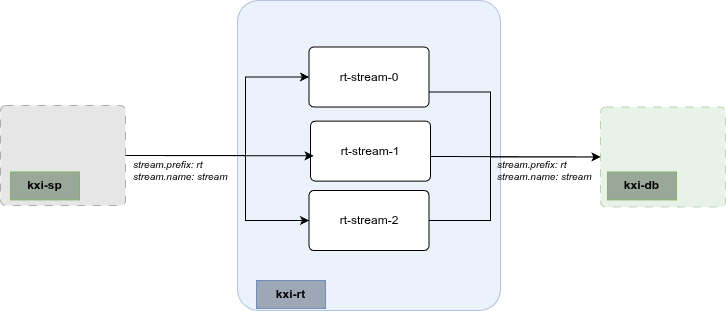

# kxi-rt Chart

## Description

This chart deploys the Insights RT component to allow a client to ingest data for [InsightsDBs](../kxi-db). This chart is deployable independently of InsightsDB.



## Running on Kubernetes

### Prerequisites

1. A working Kubernetes cluster with appropriate access to deploy applications
1. `helm` command installed on your local machine
1. Authentication details to Kx image repositories

    ```bash
    KX_USER=....
    KX_PASS=....
    KX_REGISTRY="portal.dl.kx.com"
    NAMESPACE="kxi-sdk"
    ```

1. `imagePullSecrets` setup on your cluster

    ```bash
    kubectl create secret docker-registry kx-pull-secret --docker-username=$KX_USER --docker-password=$KX_PASS --docker-server=$KX_REGISTRY -n $NAMESPACE
    ```

1. A license secret
  _Contact KX to get a license_

    ```bash
    LIC_FILE=./kc.lic
    kubectl create secret generic kx-license --from-file=license=$LIC_FILE -n $NAMESPACE
    ```

1. A deployment specific values file (`myvalues.yaml`) with configurations relative to your deployment. Available configurations are documented in the chart. This can be displayed by running

    ```bash
    # Run from kxCharts/kxi-rt directory
    helm show values .
    ```

   A minimum `myvalues.yaml` configuration would contain

    ```yaml
    imagePullSecrets:
    - name: kx-pull-secret
    
    # You must set your license name. Default is 'kc.lic'
    # Available types are:
    #  - kc.lic
    #  - k4.lic
    #  - kx.lic
    kxLicenseName: kc.lic
    ```

### Deploying

```bash
# Run from '.../kxCharts/kxi-rt' directory
RELEASENAME=stream # Unique name for this deployment
VALUESFILE=myvalues.yaml
helm install $RELEASENAME . -f $VALUESFILE -n $NAMESPACE
```

#### RT Streams naming conventions and discovery

To publish and subscribe to data on a deployed RT instance it is necessary that you ensure your RT clients (the publishers and subscribers to/from RT) can discover and connect to the correct RT. This is done via known hostname/service resolution. RT Client must define the RT `stream.prefix` and the `stream.name` in their configuration.

- The `stream.prefix` is typically `rt-` and should not be changed from the default
- The `stream.name` is a uniquely identifying string associated to a deployed RT message bus

When deploying this `kxi-rt` chart with the command it will deploy up to 3 replicas (depending on configuration) of the RT message bus providing resources

```bash
helm install stream . 
```

```bash
service/rt-stream-0
service/rt-stream-1
service/rt-stream-2  
```

This is illustrated in the architecture diagram along with the potential client configuration to stream into and out of this RT deployment

As can be seen `stream.prefix` is `rt-` and the `stream.name` is `stream`. As such to allow RT clients to publish to and subscribe to this RT message bus we must set their configuration to

- `stream.prefix: rt-`
- `stream.name: stream`

Helpers within the`kxi-rt` chart will check for a prefix of `rt-` and if not present append when naming resources.

### Upgrading/updating config

Upgrading and updating configuration are executed using `helm upgrade`. This will deploy any changes made to the charts or configuration since the last deploy and automatically redeploy the latest to the application

```bash
helm upgrade $RELEASENAME . -f myvalues.yaml -n $NAMESPACE
```
