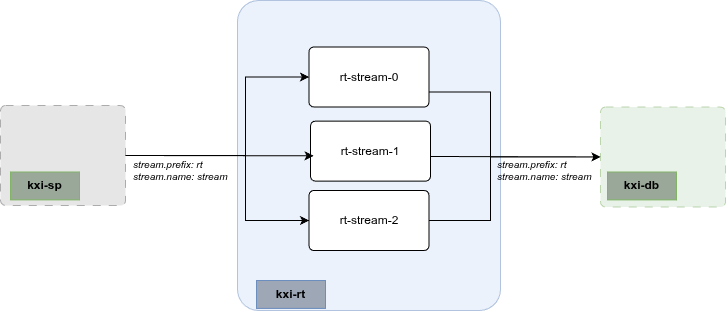

# kxi-rt Chart

## Description

This chart deploys the Insights RT component to allow a client to ingest data for [InsightsDBs](../kxi-db). This chart is deployable independently of InsightsDB.



## Running on Kubernetes

### Prerequisites

1. A working Kubernetes cluster with appropriate access to deploy applications
1. `helm` command installed on your local machine
1. Authentication details to Kx image repositories

    ```bash
    KX_USER=....
    KX_PASS=....
    KX_REGISTRY="portal.dl.kx.com"
    NAMESPACE="kxi-sdk"
    ```

1. `imagePullSecrets` setup on your cluster

    ```bash
    kubectl create secret docker-registry kx-pull-secret --docker-username=$KX_USER --docker-password=$KX_PASS --docker-server=$KX_REGISTRY -n $NAMESPACE
    ```

1. A license secret
  _Contact KX to get a license_

    ```bash
    LIC_FILE=./kc.lic
    kubectl create secret generic kx-license --from-file=license=$LIC_FILE -n $NAMESPACE
    ```

1. A deployment specific values file (`myvalues.yaml`) with configurations relative to your deployment. Available configurations are documented in the chart. This can be displayed by running

    ```bash
    # Run from kxCharts/kxi-rt directory
    helm show values .
    ```

   A minimum `myvalues.yaml` configuration would contain

    ```yaml
    imagePullSecrets:
    - name: kx-pull-secret

    # -- You must set your license name. Default is `"kc.lic"`.
    # Available types are:
    #  - `"kc.lic"`
    #  - `"k4.lic"`
    #  - `"kx.lic"`
    kxLicenseName: "kc.lic"
    ```

### Deploying

```bash
# Run from '.../kxCharts/kxi-rt' directory
RELEASENAME=stream # Unique name for this deployment
VALUESFILE=myvalues.yaml
helm install $RELEASENAME . -f $VALUESFILE -n $NAMESPACE
```

#### RT Streams naming conventions and discovery

To publish and subscribe to data on a deployed RT instance it is necessary that you ensure your RT clients (the publishers and subscribers to/from RT) can discover and connect to the correct RT. This is done via known hostname/service resolution. RT Client must define the RT `stream.prefix` and the `stream.name` in their configuration.

- The `stream.prefix` is typically `rt-` and should not be changed from the default
- The `stream.name` is a uniquely identifying string associated to a deployed RT message bus

When deploying this `kxi-rt` chart with the command it will deploy up to 3 replicas (depending on configuration) of the RT message bus providing resources

```bash
helm install stream .
```

```bash
service/rt-stream-0
service/rt-stream-1
service/rt-stream-2
```

This is illustrated in the architecture diagram along with the potential client configuration to stream into and out of this RT deployment

As can be seen `stream.prefix` is `rt-` and the `stream.name` is `stream`. As such to allow RT clients to publish to and subscribe to this RT message bus we must set their configuration to

- `stream.prefix: rt-`
- `stream.name: stream`

Helpers within the`kxi-rt` chart will check for a prefix of `rt-` and if not present append when naming resources.

### Upgrading/updating config

Upgrading and updating configuration are executed using `helm upgrade`. This will deploy any changes made to the charts or configuration since the last deploy and automatically redeploy the latest to the application

```bash
helm upgrade $RELEASENAME . -f myvalues.yaml -n $NAMESPACE
```

## Configuration Options

### Local Configurations

Local values configuration for `kxi-rt`.

| Key | Type | Default | Description |
|-----|------|---------|-------------|
| `affinity` | `object` | <code>{}</code> | This is for adding affinities to the Reliable Transport.<br>Refer to [Pod Affinity](https://kubernetes.io/docs/concepts/scheduling-eviction/assign-pod-node/#affinity-and-anti-affinity). |
| `args` | `list` | <code>[<br/>&nbsp;&nbsp;"-time",<br/>&nbsp;&nbsp;"10080",<br/>&nbsp;&nbsp;"-disk",<br/>&nbsp;&nbsp;"90"<br/>]</code> | Can provide any valid `q` runtime argument here.<br>Full details [here](https://code.kx.com/q/basics/cmdline/).<br>Additionally RT archival configuration can be provided here.<br>More information can be found [here](https://code.kx.com/insights/microservices/rt/index.html#archiver). |
| `envs` | `list` | <code>[<br/>&nbsp;&nbsp;{<br/>&nbsp;&nbsp;&nbsp;&nbsp;"name": "RT_LOGLEVEL_CONSOLE",<br/>&nbsp;&nbsp;&nbsp;&nbsp;"value": "INFO"<br/>&nbsp;&nbsp;},<br/>&nbsp;&nbsp;{<br/>&nbsp;&nbsp;&nbsp;&nbsp;"name": "RT_QURAFT_LOG_LEVEL",<br/>&nbsp;&nbsp;&nbsp;&nbsp;"value": "INFO"<br/>&nbsp;&nbsp;},<br/>&nbsp;&nbsp;{<br/>&nbsp;&nbsp;&nbsp;&nbsp;"name": "RT_LOG_LEADER",<br/>&nbsp;&nbsp;&nbsp;&nbsp;"value": "1"<br/>&nbsp;&nbsp;}<br/>]</code> | Additional ENVs can be added and these overridden in custom values files.<br>For RT configuration options see [here](https://code.kx.com/insights/enterprise/configuration/rt-archival.html#raft-log-retention). |
| `externalService` | `object` | <code>{}</code> | This is for setting up a additional external services.<br>Setting type to `LoadBalancer` and enabling will expose endpoints external to cluster.<br>More information can be found [here](https://kubernetes.io/docs/concepts/services-networking/service/). |
| `externalService.annotations` | `object` | <code>{}</code> | This sets the service annotations for the External RT Service.<br>Dictionary of key-value pairs.<br>Refer to [Object Annotations](https://kubernetes.io/docs/concepts/overview/working-with-objects/annotations/). |
| `externalService.enabled` | `bool` | <code>false</code> | By default external services are disabled |
| `externalService.loadBalancerIPs` | `object` | <code>{}</code> | This allows you to specify your LoadBalancer's external IP address Should specify one per replica.<br>e.g.<br>`replicaCount: 3`, three IPs should be listed.<br>More information can be found [here](https://kubernetes.io/docs/concepts/services-networking/service/#loadbalancer). |
| `externalService.type` | `string` | <code>"LoadBalancer"</code> | This sets the Service type.<br>Setting the type field to `LoadBalancer` provisions a load balancer for your Service.<br>The actual creation of the load balancer happens asynchronously, and information about the provisioned balancer is published in the Service's `.status.loadBalancer`.<br>More information can be found [here](https://kubernetes.io/docs/concepts/services-networking/service/#publishing-services-service-types). |
| `externalService.useSsl` | `bool` | <code>false</code> | Set to true if you plan to add certification and utilize TCP for data publication. |
| `image` | `object` | <code>{}</code> | Default image repository and pull settings for Insights RT chart components.<br>Refer to [Images](https://kubernetes.io/docs/concepts/containers/images/). |
| `image.pullPolicy` | `string` | <code>"IfNotPresent"</code> | Image pull policy.<br>Refer to [Image Pull Policy](https://kubernetes.io/docs/concepts/containers/images/#image-pull-policy). |
| `image.repository` | `string` | <code>"portal.dl.kx.com/"</code> | Image repository. |
| `imagePullSecrets` | `list` | <code>[]</code> | Image pull secrets to be applied to all pods within the chart.<br>For pulling an image from a private repository.<br>Refer to [Image Pull Secrets](https://kubernetes.io/docs/tasks/configure-pod-container/pull-image-private-registry/). |
| `kxLicenseName` | `string` | <code>"kc.lic"</code> | You must set your license name.<br>Available types are:  - `"kc.lic"`  - `"k4.lic"`  - `"kx.lic"` |
| `kxiSidecar` | `object` | <code>{}</code> | Default Sidecar configuration for Reliable Transport chart components |
| `kxiSidecar.image` | `object` | <code>{}</code> | This sets overriding container image information.<br>Use if you wish to target specific versions of the kxiSidecar.<br>More information can be found [here](https://kubernetes.io/docs/concepts/containers/images/). |
| `kxiSidecar.image.tag` | `string` | <code>"1.19.2"</code> | Image tag. |
| `livenessProbe` | `object` | <code>{}</code> | Configure Liveness Probe for chart.<br>Refer to [Configure Probes](https://kubernetes.io/docs/tasks/configure-pod-container/configure-liveness-readiness-startup-probes/). |
| `livenessProbe.httpGet` | `object` | <code>{}</code> | Defines a probe of type `"httpGet"`. |
| `livenessProbe.httpGet.path` | `string` | <code>"/readiness"</code> | Path to access on the HTTP server. |
| `livenessProbe.httpGet.port` | `int` | <code>6000</code> | Name or number of the port to access on the container. |
| `livenessProbe.initialDelaySeconds` | `int` | <code>60</code> | Number of seconds after the container has started before liveness probes are initiated. |
| `livenessProbe.periodSeconds` | `int` | <code>10</code> | How often (in seconds) to perform the probe. |
| `livenessProbe.successThreshold` | `int` | <code>1</code> | Minimum consecutive successes for the probe to be considered successful after having failed. |
| `nodeSelector` | `object` | <code>{}</code> | Allows adding node selector constraints to the Reliable Transport.<br>This constrains the pods to run only on nodes that match the specified labels.<br>Dictionary of key-value pairs.<br>Refer to [NodeSelector](https://kubernetes.io/docs/concepts/scheduling-eviction/assign-pod-node/#nodeselector). |
| `persistence.accessModes` | `list` | <code>[<br/>&nbsp;&nbsp;"ReadWriteOnce"<br/>]</code> | Persistent Volume Claim Access Modes.<br>More information can be found [here](https://kubernetes.io/docs/concepts/storage/persistent-volumes/#access-modes). |
| `persistence.capacity` | `string` | <code>"2Gi"</code> | Specifies the storage capacity request for the Persistent Volume Claim. |
| `persistence.storageClass` | `string` | <code>""</code> | Persistent Volume Claim StorageClass.<br>More information can be found [here](https://kubernetes.io/docs/concepts/storage/storage-classes/). |
| `podAnnotations` | `object` | <code>{}</code> | Custom annotations to be applied to Pod resources.<br>Dictionary of key-value pairs.<br>Refer to [Object Annotations](https://kubernetes.io/docs/concepts/overview/working-with-objects/annotations/). |
| `podLabels` | `object` | <code>{}</code> | Custom labels to be applied to Pod resources.<br>Dictionary of key-value pairs.<br>Refer to [Object Labels](https://kubernetes.io/docs/concepts/overview/working-with-objects/labels/). |
| `podManagementPolicy` | `string` | <code>"Parallel"</code> | Define how pods are created/deleted.<br>`OrderedReady`, sequential; `Parallel`, all at once.<br>Refer to [Pod Management](https://kubernetes.io/docs/concepts/workloads/controllers/statefulset/#pod-management-policies). |
| `podSecurityContext` | `object` | <code>{}</code> | Default Pod Security Context for Reliable Transport chart components.<br>Refer to [Pod Security Context](https://kubernetes.io/docs/tasks/configure-pod-container/security-context/#set-the-security-context-for-a-pod). |
| `raft` | `object` | <code>{<br/>&nbsp;&nbsp;"chunkSize": 0.25,<br/>&nbsp;&nbsp;"heartbeat": 1000,<br/>&nbsp;&nbsp;"internalTimer": 10,<br/>&nbsp;&nbsp;"logSize": 2<br/>}</code> | Configuration for RT Raft. |
| `readinessProbe` | `object` | <code>{}</code> | Configure Readiness Probe for chart.<br>Refer to [Configure Probes](https://kubernetes.io/docs/tasks/configure-pod-container/configure-liveness-readiness-startup-probes/). |
| `readinessProbe.httpGet` | `object` | <code>{}</code> | Defines a probe of type `"httpGet"`. |
| `readinessProbe.httpGet.path` | `string` | <code>"/readiness"</code> | Path to access on the HTTP server. |
| `readinessProbe.httpGet.port` | `int` | <code>6000</code> | Name or number of the port to access on the container. |
| `readinessProbe.periodSeconds` | `int` | <code>2</code> | How often (in seconds) to perform the probe. |
| `readinessProbe.successThreshold` | `int` | <code>2</code> | Minimum consecutive successes for the probe to be considered successful after having failed. |
| `readinessProbe.timeoutSeconds` | `int` | <code>5</code> | Number of seconds after which the probe times out. |
| `replicaCount` | `int` | <code>3</code> | This sets the `replicaSet` count.<br>More information can be found [here](https://kubernetes.io/docs/concepts/workloads/controllers/deployment/#replicas-and-scaling). |
| `resources` | `object` | <code>{}</code> | Reliable Transport Kubernetes resources.<br>Refer to [Container Resources](https://kubernetes.io/docs/concepts/configuration/manage-resources-containers/). |
| `securityContext` | `object` | <code>{}</code> | Default security context for Reliable Transport chart components.<br>Refer to [Security Context](https://kubernetes.io/docs/tasks/configure-pod-container/security-context/#set-the-security-context-for-a-container). |
| `service` | `object` | <code>{}</code> | Provisions the Kubernetes Service required to expose the workloads.<br>More information can be found [here](https://kubernetes.io/docs/concepts/services-networking/service/). |
| `service.annotations` | `object` | <code>{}</code> | This sets the service annotations for the Internal RT Service.<br>Dictionary of key-value pairs.<br>Refer to [Object Annotations](https://kubernetes.io/docs/concepts/overview/working-with-objects/annotations/). |
| `service.type` | `string` | <code>"ClusterIP"</code> | Sets the Service type.<br>Refer to [Service Types](https://kubernetes.io/docs/concepts/services-networking/service/#publishing-services-service-types). |
| `serviceAccount` | `object` | <code>{}</code> | Configure `ServiceAccount` to be used within chart.<br>Refer to [Service Accounts](https://kubernetes.io/docs/concepts/security/service-accounts/). |
| `serviceAccount.annotations` | `object` | <code>{}</code> | Custom annotations to add to the Service Account.<br>Dictionary of key-value pairs.<br>Refer to [Object Annotations](https://kubernetes.io/docs/concepts/overview/working-with-objects/annotations/). |
| `serviceAccount.autoMount` | `bool` | <code>true</code> | Automatically mount a Service Account's API credentials. |
| `serviceAccount.create` | `bool` | <code>true</code> | Specifies whether a Service Account should be created. |
| `serviceAccount.name` | `string` | <code>""</code> | The name of the Service Account to use.<br>If not set and create is `true`, a name is generated using the fullname template. |
| `tolerations` | `list` | <code>[]</code> | Allows adding tolerations to the Reliable Transport.<br>This allows the pods to be scheduled on nodes with matching taints.<br>Refer to [Taint and Tolerations](https://kubernetes.io/docs/concepts/scheduling-eviction/taint-and-toleration/). |
| `updateStrategy` | `object` | <code>{}</code> | Define how pod updates are applied.<br>`RollingUpdate`, replace gradually; `OnDelete`, replace only on delete.<br>More information can be found [here](https://kubernetes.io/docs/concepts/workloads/controllers/statefulset/#update-strategies). |
| `volumeMounts` | `list` | <code>[]</code> | Additional volumeMounts on the output Deployment definition.<br>Refer to [Volumes](https://kubernetes.io/docs/concepts/storage/volumes/). |
| `volumes` | `list` | <code>[]</code> | Additional volumes on the output Deployment definition.<br>Refer to [Volumes](https://kubernetes.io/docs/concepts/storage/volumes/). |

