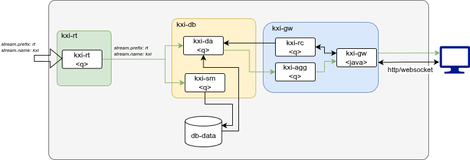

# Ingest and Persist - RT Based Reference Architecture

## Description
In this reference architecture deployment, the use case is ‘Ingest and Persist’ and will utilise the kxi-db, kxi-gw and kxi-rt microservices.

## Architecture
- A kxi-db encompassing the core elements of the InsightsDB (kxi-da, kxi-sm) which can ingest and persist data
- A kxi-rt as the message bus to log the ingested data and publish to the kxi-db component
- A kxi-gw (kxi-rc, kxi-agg, kxi-gw) used to query the data from the kxi-db 



### Prerequisites

1. Latest versions of `docker` and `docker compose` installed
1. Authentication details to Downloads portal for Kx image repositories
   ```bash
   KX_USER=....
   KX_PASS=....
   KX_REGISTRY="portal.dl.kx.com"
   ```

1. A KX License available


### Setup and Configuration

1. Login to downloads portal
   ```bash
   docker login $KX_REGISTRY -u $KX_USER -p $KX_PASS
   ```
1. Store the License as environment variable

   (_Contact KX to get a license_)
   ```bash
   # KC Licenses
   export KDB_LICENSE_B64=$(base64 path-to/kc.lic)
   # K4 Licenses
   # export KDB_K4LICENSE_B64=$(base64 path-to/k4.lic)
   ```
   Check License name and use the appropriate environment variable name. If using `k4.lic` license, update the docker yaml environmental variable to match.

1. **Volumes**  
   `db`, `logs` and `logs_rt` use Docker **named volumes** (persist across container restarts). `config`, `packages` and `sidecar_cfg` are **bind-mounted** from the host (see `.env`: `kxi_dir_config`, `kxi_dir_pkgs`, `kxi_dir_sidecar_cfg`). Ensure `./config` exists with assembly and other files. To remove named volumes (e.g. for a clean slate), run `docker compose -f kxi-ingest-persist.yaml down -v`.

## Quickstart

To start the application, run the following command.

```bash
docker compose -f kxi-ingest-persist.yaml up
```

Running this command starts the kdb Insights Database with a collection of sample schemas included in the `config/assembly.yaml` configuration file.

Once started, review logs for any errors to confirm everything is running. It is likely as the services come up, warnings are logged until all dependencies are fully running.

```bash
# Typical log scraping command
docker compose -f kxi-ingest-persist.yaml logs --no-log-prefix 2>&1 | grep -iE "(error|fatal|exception|panic|critical)" | head -100
```

## Publish Data

The assembly workload in this example is available in [config/assembly](./config/assembly.yaml) and its provides a schema focused on taxi data in a table `taxi`. We'll publish the contents of the [taxi.csv](../samples/taxi.csv) to this database. Data can be published in through numerous channels including Java, Python & KDB with further [samples](../samples) available for various scenarios.

To publish with q download the [rt.qpk](https://code.kx.com/insights/microservices/database/deploy/kubernetes/database-rt.html#publish), which provides APIs for publishing and subscribing to an RT stream.

```bash
version=1.13.0
curl -L  https://portal.dl.kx.com/assets/raw/rt/$version/rt.$version.qpk -o rt.$version.qpk
unzip rt.$version.qpk
cd rt
q startq.q
```

```q
params:(`path`stream`publisher_id`cluster)!("/tmp/rt";"data";"pub1";enlist(":127.0.0.1:5002"))
p:.rt.pub params
show taxi:("SPPHEEEEEEEES";enlist",")0: hsym`$"../../samples/taxi.csv"
p(`.b; `taxi; update pickup:.z.p,dropoff:.z.p+0D00:15:00.0 from taxi)
```

## Query data

Data can be queried through numerous client with [samples](../samples) available for various scenarios. Below are examples using REST and KDB

### Query with REST

```bash
curl -X POST -H 'Content-Type: application/json' http://localhost:8080/data -d '{"table":"taxi"}'
```

### Query with KDB

```q
h:hopen 5050 // SG Port
r:h(`.kxi.getData;enlist[`table]!enlist`taxi;`;()!())
@[;1]h(`.kxi.qsql; enlist[`query]!enlist"select vendor,pickup,dropoff from taxi";`;()!())
```

## Packages and Custom Code 

The SDK supports injecting custom code into the `kxi-db` through packages via the `KX_PACKAGES` environment variable or custom q scripts via the `KXI_CUSTOM_FILE` env file. These can be defined in the `kxi-da` or the `kxi-agg` services with examples for both in these reference architectures.

### Packages

Under the [./config/packages](./config/packages) directory there is a `custom` package (version 1.0.0) containing a simple [user defined analytic (uda)](https://code.kx.com/insights/1.17/microservices/database/configuration/uda.html) which loads into the `kxi-db` services which can be used to query data from the database.

```q
# Open connection to `kxi-db` and retrieve available API via meta
h:hopen 5050
res:h(`.kxi.getMeta;()!();`;enlist[`version]!enlist 3);
# Displayed API will include `.example.daAPI`
res[1][`api]
```

This allows the user develop, build, version and publish a extensive API as part of his SDK reference application. API's can be quiered in the same way as `.kxi.getData` is queried.

```bash
curl "http://localhost:8080/example.daAPI?table=taxi;column=fare;multiplier=10"
```

```q
h:hopen 5050 // SG Port
// Query .example.daAPI
r:h(`.example.daAPI;enlist[`table`column`multiplier]!enlist`taxi;`fare;10;`;()!())
// Display playload
r 1
```

### Custom Code

Code pushed to the environment variable `KXI_CUSTOM_FILE` can be deployed to the `kxi-agg` and `kxi-da` service. This directory is mounted on the service and is loaded on startup. The reference application mounts the [./config/](./config) directory to `/mnt/config` on the docker container and the `KXI_CUSTOM_FILE` defines the file (`/mnt/config/src/agg/custom.q`|`/mnt/config/src/da/custom.q`) the service loads. this allows the user to build complex custom logic into their database.

## Metrics

The [kxi-ingest-persist.yaml](./kxi-ingest-persist.yaml) docker compose file includes the necessary sidecars to provide metric data for the running services. These are exposed inside the docker `kx` network.

A metrics stack can be launched to view and monitor metrics and utilise grafana to build operational dashboards from these metrics.


```bash
# Create prometheus data directory if it doesn't exist
# mkdir ./prometheus-data
# chmod -R 777 prometheus-data

# Run from the ../docker/metrics directory
docker compose -f compose-metrics.yaml up
```
Prometheus will be available on the server running the docker instance at [http://localhost:9090](http://localhost:9090). Grafana will be available at (http://localhost:3000)[http://localhost:3000].

## Further Reading

For more information about kdb Insights and its associated configuration, see the [kdb Insights documentation](https://code.kx.com/insights/microservices/database/).
