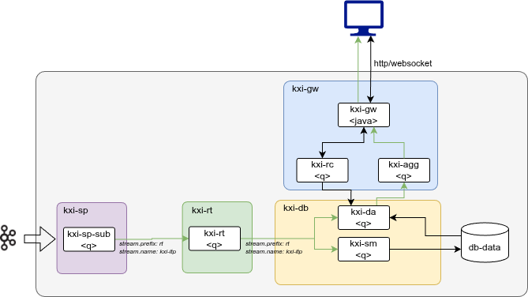

# Ingest, Transform and Persist - SP Based Reference Architecture

## Description
In this reference architecture deployment blueprint, the Use Case is ‘Ingest, Transform and Persist’ and will utilise the kxi-db, kxi-gw, kxi-rt and kxi-sp microservices. The goal of this reference architecture is to highlight a typical deployment of the SDK components with the Stream Processor as a means to read in and transform data. for more information on how to utilise the SP within SDK workload please review the [documentation](https://code.kx.com/insights/1.17/microservices/stream-processor/index.html).

## Architecture
- A kxi-db encompassing the core elements of the InsightsDB (kxi-da, kxi-sm) which can ingest and persist data
- A kxi-rt as the message bus to log the ingested data and publish to the kxi-db component
- A kxi-gw (kxi-rc, kxi-agg, kxi-gw) used to query the data from the kxi-db
- A kxi-sp stream processing system, to taking in the data, transforming and publishing it



### Prerequisites

1. Latest versions of `docker` and `docker compose` installed
1. Authentication details to Downloads portal for Kx image repositories
   ```bash
   KX_USER=....
   KX_PASS=....
   KX_REGISTRY="portal.dl.kx.com"
   ```

1. A KX License available

### Setup and Configuration

1. Login to downloads portal
   ```bash
   docker login $KX_REGISTRY -u $KX_USER -p $KX_PASS
   ```
1. Store the License as environment variable

   (_Contact KX to get a license_)
   ```bash
   # KC Licenses
   export KDB_LICENSE_B64=$(base64 path-to/kc.lic)
   # K4 Licenses
   # export KDB_K4LICENSE_B64=$(base64 path-to/k4.lic)
   ```
   Check License name and use the appropriate environment variable name. If using `k4.lic` license, update the docker yaml environmental variable to match.

1. **Volumes**  
   `db`, `logs`, `logs_rt` and `sp` use Docker **named volumes** (persist across container restarts). `config`, `packages` and `sidecar_cfg` are **bind-mounted** from the host (see `.env`: `kxi_dir_config`, `kxi_dir_pkgs`, `kxi_dir_sidecar_cfg`). Ensure `./config` exists with assembly and other files. To remove named volumes (e.g. for a clean slate), run `docker compose -f kxi-ingest-transform-persist.yaml down -v`.

## Quickstart

To start the application, run the following command.

```bash
docker compose -f kxi-ingest-transform-persist.yaml up
```

Running this command starts the kdb Insights Database with a collection of sample schemas included in the `config/assembly.yaml` configuration file.

Once started, review logs for any errors to confirm everything is running. It is likely as the services come up, warnings are logged until all dependencies are fully running.

```bash
# Typical log scraping command
docker compose -f kxi-ingest-transform-persist.yaml logs --no-log-prefix 2>&1 | grep -iE "(error|fatal|exception|panic|critical)" | head -100
```

## Ingest and Transform using SP

When launching the docker compose file, as well as the database it also launches an Stream Processor workload which does a bulk read data from S3 and write to an Insights SDK Database. Arbitrary data files can be read from S3, transformed and written to downstream consumers from the Stream Processor. 

A pipeline definitions is already created in [`ingest.q`](ingest.q).  It does the following;

- reads data from a public S3 bucket
- uses a CSV decoder to format the data using the schema object
- renames some columns
- transforms the data to match the database schema by adding an empty fees column and reordering
- writes the data to the taxi schema in the database using a target of kxi-sm:10001
- the target value corresponds to SM service's endpoint
- directWrite is enabled to specify that data should be written directly to the database instead of streamed

### Ingestion status checks

You can check status of the pipeline using the command.
```
curl http://localhost:6000/details
```
This outputs a JSON payload of the form
```
{
  "state": "RUNNING",
  "error": "",
  "metrics": {
    "eventRate": 0,
    "bytesRate": 0,
    "latency": -1.7976931348623157e+308,
    "inputRate": 8746320,
    "outputRate": 41618.86
  },
  "logCounts": {
    "trace": 0,
    "debug": 0,
    "info": 63,
    "warn": 0,
    "error": 0,
    "fatal": 0
  },
  "readerMetadata": []
}
```

The pipeline has completed when the state field is set to `FINISHED`. This indicates all of the data has been written to the database and successfully ingested. You can check the ingest session in the database using the following command.

```
curl http://localhost:10001/ingest
```

The session is marked with a status of pending while the SP pipeline is writing data.

```
[
  {
    "name": "pipeline-482f128ffe-0",
    "pipeline": "",
    "database": "kdb Insights",
    "updtype": "ingest",
    "status": "pending",
    "details": [],
    "tbls": [],
    "dates": [],
    "progress": {
      "cmdCurrent": "",
      "cmdIndex": null,
      "cmdTotal": null,
      "subCurrent": "",
      "subIndex": null,
      "subTotal": null
    },
    "error": [],
    "updated": "2024-11-22T12:12:25.518555535"
  }
]
```

This updates to processing when the database is ingesting the data.

```
[
  {
    "name": "pipeline-482f128ffe-0",
    "pipeline": "",
    "database": "kdb Insights",
    "updtype": "ingest",
    "status": "processing",
    "details": {
      "kxSessionInfo.752fb820-e0db-6c26-0803-c194e45ed5a8": {
        "pipelineName": [],
        "pipelineID": "pipeline-482f128ffe",
        "workerName": "spwork-kxi-sp",
        "operatorID": "database.writer_taxi",
        "ingestStartTime": "2024-11-22T12:12:17.580482856",
        "ingestEndTime": "2024-11-22T12:14:14.123753107"
      },
      "subsessions": [
        "752fb820-e0db-6c26-0803-c194e45ed5a8"
      ],
      "dates": [
        "2021-12-01",
        ..
        "2021-12-31"
      ],
      "tables": [
        "taxi"
      ]
    },
    "tbls": [
      "taxi"
    ],
    "dates": [
      "2021-12-01",
      "2021-12-02",
      "2021-12-03",
      "2021-12-04",
      "2021-12-05",
      "2021-12-06",
      "2021-12-07",
      "2021-12-08",
      "2021-12-09",
      "2021-12-10",
      "2021-12-11",
      "2021-12-12",
      "2021-12-13",
      "2021-12-14"
    ],
    "progress": {
      "cmdCurrent": "2021.12.14",
      "cmdIndex": 13,
      "cmdTotal": 31,
      "subCurrent": "taxi",
      "subIndex": 0,
      "subTotal": 1
    },
    "error": [],
    "updated": "2024-11-22T12:14:14.140172780"
  }
]
```

Once the database has finished ingesting it, the `status` updates to `completed` and the data is available for querying.

## Querying

You can query the first 30 minutes of the dataset to verify the ingestion and transformation with REST.

```bash
curl -X POST http://localhost:8080/data -H "Content-Type: application/json" -H "Accept: application/json" -d '{table: "taxi",startTS: "2021-12-01T00:00:00.0", endTS: "2021-12-01T00:30:00.0" }'
```
```
{
  "header": {
    "rcvTS": "2024-11-22T12:15:22.941000000",
    "corr": "69e1aa73-f069-4854-a0b1-28c439c55e47",
    "logCorr": "69e1aa73-f069-4854-a0b1-28c439c55e47",
    "http": "json",
    "api": ".kxi.getData",
    "agg": ":172.18.0.7:5060",
    "refVintage": -9223372036854776000,
    "rc": 0,
    "ac": 0,
    "ai": "",
    "limitApplied": false
  },
  "payload": [
    {
      "vendor": "Creative Mobile Tecnologies, LLC",
      "pickup": "2021-12-01T00:00:07.000000000",
      "dropoff": "2021-12-01T00:06:39.000000000",
      "passengers": 1,
      "distance": 1.8,
      "fare": 7.5,
      "extra": 3,
      "tax": 0.5,
      "tip": 2.8,
      "tolls": 0,
      "fees": 0,
      "total": 14.1,
      "payment_type": "Credit card"
    },
    {
      "vendor": "Creative Mobile Tecnologies, LLC",
      "pickup": "2021-12-01T00:00:19.000000000",
      "dropoff": "2021-12-01T00:07:24.000000000",
      "passengers": 1,
      "distance": 1.4,
      "fare": 7,
      "extra": 3.5,
      "tax": 0.5,
      "tip": 2,
      "tolls": 0,
      "fees": 0,
      "total": 13.3,
      "payment_type": "Credit card"
    },
    ..
```

Or alternatively from KDB+

```q
h:hopen 5050
r:h(`.kxi.getData;enlist[`table]!enlist`taxi;`;()!())
@[;1]h(`.kxi.qsql; enlist[`query]!enlist"select vendor,pickup,dropoff from taxi";`;()!())
```

## Packages and Custom Code 

The SDK supports injecting custom code into the `kxi-db` through packages via the `KX_PACKAGES` environment variable or custom q scripts via the `KXI_CUSTOM_FILE` env file. These can be defined in the `kxi-da` or the `kxi-agg` services with examples for both in these reference architectures.

### Packages

Under the [./config/packages](./config/packages) directory there is a `custom` package (version 1.0.0) containing a simple [user defined analytic (uda)](https://code.kx.com/insights/1.17/microservices/database/configuration/uda.html) which loads into the `kxi-db` services which can be used to query data from the database.

```q
# Open connection to `kxi-db` and retrieve available API via meta
h:hopen 5050
res:h(`.kxi.getMeta;()!();`;enlist[`version]!enlist 3);
# Displayed API will include `.example.daAPI`
res[1][`api]
```

This allows the user develop, build, version and publish a extensive API as part of his SDK reference application. API's can be quiered in the same way as `.kxi.getData` is queried.

```bash
curl "http://localhost:8080/example.daAPI?table=taxi;column=fare;multiplier=10"
```

```q
h:hopen 5050 // SG Port
// Query .example.daAPI
r:h(`.example.daAPI;enlist[`table`column`multiplier]!enlist`taxi;`fare;10;`;()!())
// Display playload
r 1
```

### Custom Code

Code pushed to the environment variable `KXI_CUSTOM_FILE` can be deployed to the `kxi-agg` and `kxi-da` service. This directory is mounted on the service and is loaded on startup. The reference application mounts the [./config/](./config) directory to `/mnt/config` on the docker container and the `KXI_CUSTOM_FILE` defines the file (`/mnt/config/src/agg/custom.q`|`/mnt/config/src/da/custom.q`) the service loads. this allows the user to build complex custom logic into their database.
