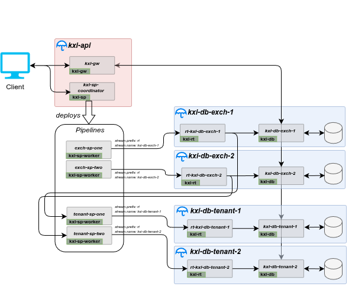

# Sharded Databases Reference Architecture

## Description

This reference architecture deploys a multi-database, multi-shard application using Docker Compose. It offers a templated example of how to build a horizontally scalable database with kdb Insights microservices. It utilises data sharding to ensure ingestion and persistence can scale as data volume grows, using separate exchange and tenant databases each split across two shards.


## Architecture

- Four independent kxi-db shards, grouped by type:
  - **Exchange shards** (`kxi-db-exch-1`, `kxi-db-exch-2`): store `trade` data partitioned by exchange
  - **Tenant shards** (`kxi-db-tenant-1`, `kxi-db-tenant-2`): store `position` data partitioned by tenant
- Each shard comprises its own kxi-da, kxi-sm, and kxi-rt instance with a dedicated RT stream
- A single shared kxi-gw (kxi-rc, kxi-agg, kxi-gw) used to query data across all shards
- An optional kxi-sp coordinator for stream processing

Each shard is deployed as a separate Docker Compose project using a common template (`kxi-db-shard.yaml`) parameterised by a shard-specific env file.




### Prerequisites

1. **Docker Compose v2+** — multiple `--env-file` flags are not supported in Compose v1 (`docker-compose`). Use the `docker compose` plugin. Check with `docker compose version`.
1. Authentication details to Downloads portal for Kx image repositories

   ```bash
   KX_USER=....
   KX_PASS=....
   KX_REGISTRY="portal.dl.kx.com"
   ```

1. A KX License available

### Setup and Configuration

1. Login to downloads portal

   ```bash
   docker login $KX_REGISTRY -u $KX_USER -p $KX_PASS
   ```

1. Store the License as environment variable

   (_Contact KX to get a license_)

   ```bash
   # KC Licenses
   export KDB_LICENSE_B64=$(base64 path-to/kc.lic)
   # K4 Licenses
   # export KDB_K4LICENSE_B64=$(base64 path-to/k4.lic)
   ```

   Check the license name and use the appropriate environment variable. If using a `k4.lic` license, update the `license.env` file in this directory.

1. **Volumes**

   All volumes are **bind-mounted**. The `config` and `packages` directories are used for configuration (see `.env`: `kxi_dir_config`, `kxi_dir_pkgs`). The `db`, `logs`, and `rt_logs` directories are for the database and write-ahead log. Create them before running and ensure they are writable by user `nobody` (65534). You can modify the user by setting the `DOCKER_UID` and `DOCKER_GID` values inside the `.env` file.

   Each shard uses its own data directories to avoid conflicts between instances.

   ```bash
   # Run from .../referenceArchitectures/docker/kxi-sharded-databases
   mkdir -p data/exch-1/{db,logs,logs_rt} data/exch-2/{db,logs,logs_rt} \
            data/tenant-1/{db,logs,logs_rt} data/tenant-2/{db,logs,logs_rt}
   chmod -R 777 ./data

   # Stream Processor pipeline data directories
   mkdir -p spScripts/checkpoints/controller spScripts/checkpoints/trade spScripts/checkpoints/positions
   chmod -R 777 ./spScripts/checkpoints
   ```

1. Create a shared Docker network that all services can use

   ```bash
   docker network create kx
   ```

## Deploying

Each shard is deployed as a separate Docker Compose project using a per-shard env file. The `COMPOSE_PROJECT_NAME` in each shard env file ensures the stacks remain isolated.

### Deploy the shared gateway

```bash
docker compose --env-file .env -f kxi-gw.yaml -p kxi-sharded-gw up -d
```


### Deploy database shards

```bash
docker compose --env-file .env --env-file env-kxi-db-exch-1 -f kxi-db-shard.yaml -p kxi-db-exch-1 up -d
docker compose --env-file .env --env-file env-kxi-db-exch-2 -f kxi-db-shard.yaml -p kxi-db-exch-2 up -d
docker compose --env-file .env --env-file env-kxi-db-tenant-1 -f kxi-db-shard.yaml -p kxi-db-tenant-1 up -d
docker compose --env-file .env --env-file env-kxi-db-tenant-2 -f kxi-db-shard.yaml -p kxi-db-tenant-2 up -d
```

### Validate docker containers

Once started, review logs for any errors to confirm everything is running. Warnings are expected while services are starting up and establishing connections.

```bash
# View logs for a specific shard
docker compose -p kxi-db-exch-1 -f kxi-db-shard.yaml logs --no-log-prefix 2>&1 | grep -iE "(error|fatal|exception|panic|critical)" | head -100
# View gateway logs
docker compose -p kxi-sharded-gw -f kxi-gw.yaml logs --no-log-prefix 2>&1 | grep -iE "(error|fatal|exception|panic|critical)" | head -100
```

## Publish Data


### Deploying Pipelines

The stream processor stack (`spScripts/kxi-sp.yaml`) runs a controller on port 6000 and two workers — one per pipeline spec (`trade_spec.q`, `position_spec.q`).

Create the checkpoint directories, then start the stack:

```bash
# Run from .../referenceArchitectures/docker/kxi-sharded-databases
docker compose --env-file .env -f kxi-sp.yaml -p spworker up -d
```

Verify all workers have registered with the controller:

```bash
curl localhost:6000/status
# Will return "RUNNING" if successful
```


The assembly files for each shard are in `config/` and define the following schemas:

- **Exchange shards** (`kxi-db-exch-1-assembly.yaml`, `kxi-db-exch-2-assembly.yaml`): `trade` table with columns `time`, `sym`, `exch`, `side`, `price`, `size`, `tradeID`, `id`. Tables are marked `isSharded: true`.
- **Tenant shards** (`kxi-db-tenant-1-assembly.yaml`, `kxi-db-tenant-2-assembly.yaml`): `position` table with columns `time`, `sym`, `tenant`, `position`. Tables are marked `isSharded: true`.

> **Why four assembly files?** The assembly format does not support variable substitution, so a dedicated file is required per shard instance. Within each pair (exchange or tenant), the two files are identical except for three shard-specific fields: `name`, `labels.shrd`, and `bus.stream.topic`. These fields are marked `# SHARD-SPECIFIC` inside each file. The exchange and tenant pairs differ in schema (different table name and columns) and cannot be merged.

Data is published directly to each shard's RT stream (e.g., `kxi-db-exch-1`). See the [samples](../samples) directory for client examples.

## Sample Queries

To run some queries we have to have access via the `kxi-gw` docker service. by default this exposes port 5050 (QIPC) and 8080 (REST) on the running docker host

Note in this example we will query the data with KDB and will require q to be [installed](https://developer.kx.com/products/kdb-x/install). Alternatively curl can be used per [kxi-ingest-persist](../kxi-ingest-persist/README.md#query-with-rest) example.

```bash
# Run q
q
```

```q
//Connect
h:hopen 5050;

// Retrieve ad view metadata
res:h(`.kxi.getMeta;()!();`;enlist[`version]!enlist 3);
d:last res;
d`schema;
d`assembly;
d`api;
d`rc;
d`dap;
first d`api

// Get trade data from exch database shard 1
tableName:`trade;
database:`exch;
shard:`one;
startTime:.z.p - 1u;
endTime:.z.p;
res:h(`.kxi.getData;(`table`startTS`endTS`labels)!(tableName;startTime;endTime;`group`shrd!(database;shard));`;()!())

// Returns a table of trade data sorted by time for shard exch-one
`time xdesc last res
// Returns the number of points grouped by exch
select count i by exch from last res

// Get position data from tenant database shard 1
tableName:`position;
database:`tenant;
shard:`one;
startTime:.z.p - 2u;
endTime:.z.p;
res:h(`.kxi.getData;(`table`startTS`endTS`labels)!(tableName;startTime;endTime;`group`shrd!(database;shard));`;()!());

// Returns a table of position data sorted by time for shard tenant-two
`time xdesc last res
// Returns the number of points grouped by tenant
select count i by tenant from last res

// Retrieve data for exch database (all shards)
tableName:`trade;
database:`exch;
startTime:.z.p - 1u;
endTime:.z.p;
res:h(`.kxi.getData;(`table`startTS`endTS`labels)!(tableName;startTime;endTime;(enlist `group)!(enlist database));`;()!())

// Returns a table of data for the table trade across the exch database (both shards)
last res
// Returns the number of points grouped by exch
select count i by exch from last res

// Retrieve data for tenant database (all shards)
tableName:`position;
database:`tenant;
startTime:.z.p - 1u;
endTime:.z.p;
res:h(`.kxi.getData;(`table`startTS`endTS`labels)!(tableName;startTime;endTime;(enlist `group)!(enlist database));`;()!())

// Returns a table of data for position from the tenant database (both shards)
`time xdesc last res
// Returns the number of points grouped by tenant
select count i by tenant from last res
```

## Metrics

The compose files include commented-out optional configuration for metrics collection. Uncomment the `KXI_CONFIG_FILE` and sidecar volume entries in `kxi-db-shard.yaml` if metrics collection is required. These are exposed inside the docker `kx` network.

Flip the `KXI_SG_METRICS_ENABLED` flag inside of `kxi-gw.yaml` 
```bash
# Create prometheus data directory if it doesn't exist
# mkdir ./prometheus-data
# chmod -R 777 prometheus-data

# Run from the ../docker/metrics directory
# Confirm the volume inside of compose-metrics points at the prometheus-config-shard.yml
docker compose -f compose-metrics.yaml up
```

Prometheus will be available on the server running the docker instance at [http://localhost:9090](http://localhost:9090). Grafana will be available at [<http://localhost:3000](http://localhost:3000>).

## Tearing down

```bash
docker compose -p kxi-db-exch-1 down
docker compose -p kxi-db-exch-2 down
docker compose -p kxi-db-tenant-1 down
docker compose -p kxi-db-tenant-2 down
docker compose -p kxi-sharded-gw down
docker compose -p spworker down
```

## Further Reading

For more information about kdb Insights and its associated configuration, see the [kdb Insights documentation](https://code.kx.com/insights/microservices/database/).
