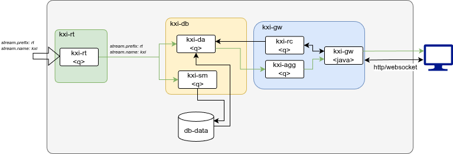

# Ingest and Persist - RT Based Reference Architecture Chart

## Description

In this reference architecture the key use case solved is ‘Ingest and Persist’. It will utilize the kxi-db, kxi-gw and kxi-rt charts

## Architecture

The implementation consists of:

- A kxi-db chart encompassing the core elements of the InsightsDB which can ingest and persist data
- A kxi-rt chart as the message bus to log the ingested data and publish to the kxi-db chart
- A kxi-gw chart used to query the data from the kxi-db chart



## Running on Kubernetes

### Prerequisites

1. A working Kubernetes cluster with appropriate access to deploy applications
1. `helm` command installed on your local machine
1. A [Distributed storage solution](../../README.md#kubernetes-prerequisites) offering RWM access level. (Kubernetes docs for more [here](https://kubernetes.io/docs/concepts/storage/persistent-volumes/#access-modes))
1. Authentication details to Kx image repositories

    ```bash
    KX_USER=....
    KX_PASS=....
    KX_REGISTRY="portal.dl.kx.com"
    NAMESPACE="kxi-sdk"
    ```

1. `imagePullSecrets` setup on your cluster

    ```bash
    kubectl create secret docker-registry kx-pull-secret --docker-username=$KX_USER --docker-password=$KX_PASS --docker-server=$KX_REGISTRY -n $NAMESPACE
    ```

1. A license secret
    _Contact KX to get a license_

    ```bash
    LIC_FILE=./kc.lic
    kubectl create secret generic kx-license --from-file=license=$LIC_FILE -n $NAMESPACE
    ```

1. A deployment specific values file associated with configurations relative to your deployment. Available configurations are documented in the chart and can be displayed by running

    ```bash
    # Run from `.../referenceArchitectures/kxi-ingest-persist` directory
    helm show values .
    ```

    A sample config file is [provided](config/kxi-ingest-persist-values.yaml) but should be reviewed and updated to your configuration.
        - **NOTE:** Please ensure to set the `storageClassName` appropriately
        - **NOTE:** This reference architecture uses a single HDB storage tier. For multi-tier HDB configuration (migrating data to slower storage as it ages), see the [storage tiers](https://code.kx.com/insights/enterprise/database/storage/tiers.html) and [tier configuration](https://code.kx.com/insights/enterprise/database/configuration/package/storage.html#tiers) documentation.

### Deploying

The umbrella chart deploys an instance of `kxi-db` InsightsDB chart and the `kxi-rt` RT message bus chart to allow data to be streamed into the database. As detailed in the [kxi-rt chart](../../../kxCharts/kxi-rt/README.md#rt-streams-naming-conventions-and-discovery), the naming convention for the deployment will be related to the `$RELEASENAME` used to deploy the chart, thus when prefixed with `rt-` deploys to `rt-$RELEASENAME`. Configuration for the RT stream is in the sample [config file](config/kxi-ingest-persist-values.yaml). The stream names are also illustrated in the architecture diagram. It is critical these are kept in sync to ensure data flows into the database.

```bash
# Run from '.../referenceArchitectures/kxi-ingest-persist/' directory
helm dependency build

RELEASENAME=kxi # Unique name for this deployment to deploy reference architecture
VALUESFILE=./config/kxi-ingest-persist-values.yaml
NAMESPACE="kxi-sdk"
helm install $RELEASENAME . -f $VALUESFILE -n $NAMESPACE
```

At this point the reference architecture will have been successfully deployed, the next step should be [publishing data](#publish-data-into-application) to the application.

#### Configuration changes

Upgrading and updating of configuration is executed using `helm upgrade`. This will deploy any changes made to the charts or configuration since the last deploy and automatically redeploy the latest to the application

```bash
helm upgrade $RELEASENAME . -f $VALUESFILE -n $NAMESPACE
```

### Data ingest/access

By default, KX reference architectures on Kubernetes do not expose external endpoints to the application and port forwarding is used. External access can be provided via Load Balancers. To enable external access points you can add the following configuration to the [config](config/kxi-ingest-persist-values.yaml) should include:

```yaml
...
# INGEST Interface
kxi-rt:
  externalService:
    enabled: true
    type: LoadBalancer
    # type: NodePort
...
...
# QUERY Interface
kxi-gw:
  service:
    type: LoadBalancer
    # type: NodePort
...
```

#### Publish data into application

To publish with q [download the `rt.qpk`](https://code.kx.com/insights/microservices/database/deploy/kubernetes/database-rt.html#publish), which provides APIs for publishing and subscribing to an RT stream.

```bash
version=1.13.0
curl -L  https://portal.dl.kx.com/assets/raw/rt/$version/rt.$version.qpk -o rt.$version.qpk
unzip rt.$version.qpk
```

Port forward the RT push server port locally

```bash
kubectl port-forward service/rt-$RELEASENAME-0 -n $NAMESPACE 5002 &
```

Publish data into RT.

```q
// Publish data from q - KDB+/KDB-X

// Set rt_endpoint to rt service 'push' port
rt_endpoint:":localhost:5002";
params:(`path`stream`publisher_id`cluster)!("/tmp/rt";"kxi";"pub1";enlist(rt_endpoint));
p:.rt.pub params;
show data:enlist`time`sym`exch`side`price`size`tradeID!(.z.p;`KX;`LSE;`buy;10.;100;first -1?0Ng);
p(`.b; `trade; data)
```

> **_NOTE:_**  If RT has been deployed with `externalService.enabled` is set to `true` a `rt-$RELEASENAME-e` service is exposed. This can be configured as `NodePort` or `LoadBalancer`. In this configuration, data can be pushed direct to that `rt_endpoint` without port forwarding.

Once data has been publish to the application, it can be [queried](#querying-data).

#### Querying data

Depending on whether you have enabled external access to the gateway or not, the URL used to access the gateway can be defined as follows:

- With external access points enabled using a `Loadbalancer`, the `$GW_URL` is set as follows:

    ```bash
    # Get the GW LoadBalancer url
    LB_HOST=`kubectl get svc $RELEASENAME-kxi-gw-sg -o jsonpath='{.status.loadBalancer.ingress[0].hostname}' -n $NAMESPACE`
    GW_URL="$LB_HOST:8080"
    ```

- Without external access the `kxi-gw-sg` service requires port forwards to be able to access the gateway. The port forwards and `$GW_URL` are set as follows:

    ```bash
    # HTTP Port
    kubectl port-forward svc/$RELEASENAME-kxi-gw-sg 8080:8080 -n $NAMESPACE &
    # qIPC port
    kubectl port-forward svc/$RELEASENAME-kxi-gw-sg 5050:5050 -n $NAMESPACE &
    GW_URL="localhost:8080"
    ```

Now that `$GW_URL` is configured you can query data:

```bash
curl -X GET -H 'Content-Type: application/json' http://$GW_URL/data -d '{"table":"trade"}'
```

### Deploying with your own database assembly definition

The instructions above deploys reference architecture with a minimal database with a trade table defined in the [assembly.yaml](../../../kxCharts/kxi-db/assembly.yaml) under `kxCharts/kxi-db/` directory. When you're ready to deploy your own assembly workload with your own schemas, you can provide your own database yaml assembly file.

1. Create your own assembly file `myassembly.yaml` in `kxCharts/kxi-db/` directory. Full info on creating database configurations [here](https://code.kx.com/insights/microservices/database/configuration/assembly/database.html).
1. Update the deployment [config](config/kxi-ingest-persist-values.yaml) to define the database configuration you wish to deploy.

    ```
    ...
    kxi-db:
      assembly:
        filename: myassembly.yaml
    ...
    ```

1. Uninstall previous deployment if it is not done yet

    ```bash
    helm uninstall $RELEASENAME -n $NAMESPACE
    ```

1. Deploy again with your own database

   ```bash
   # Run from '.../referenceArchitectures/kxi-ingest-persist/' directory
   helm dependency build

   RELEASENAME=kxi # Unique name for this deployment to deploy reference architecture
   VALUESFILE=./config/kxi-ingest-persist-values.yaml
   NAMESPACE="kxi-sdk"
   helm install $RELEASENAME . -f $VALUESFILE -n $NAMESPACE
   ```

## Cleaning up

The `kxi-ingest-persist` reference architecture deployment can be deleted with helm as follows:

```bash
helm delete $RELEASENAME -n $NAMESPACE
```

By default the policy is to not delete associated volumes to allow it to be redeployed in the future and retain the data. If necessary these should be manually managed and deleted by the user.

## Requirements

| Repository | Name | Version |
|------------|------|---------|
| file://../../../kxCharts/kxi-db | kxi-db | 1.19.3 |
| file://../../../kxCharts/kxi-gw | kxi-gw | 1.19.3 |
| file://../../../kxCharts/kxi-rt | kxi-rt | 1.19.2 |

## Configuration Options

### Subchart configuration

Configuration for subcharts of `kxi-ingest-persist`.

#### kxi-db

Configuration for the `kxi-db` Subchart.

| Key | Type | Default | Description |
|-----|------|---------|-------------|
| `kxi-db.assembly.filename` | `string` | <code>"assembly.yaml"</code> | This defines the assembly file to be loaded into the InsightsDB.<br>It should be on the base directory of the chart folder under `kxi-db`.<br>More information can be found [here](https://code.kx.com/insights/microservices/database/configuration/assembly/database.html). |
| `kxi-db.db.hdbt1.size` | `string` | <code>""</code> | Size of the HDB Tier 1 persistent storage. |
| `kxi-db.db.hdbt1.storageClassName` | `string` | <code>""</code> | Defines the storageClassNames for all the persistent data storage in the InsightsDB.<br>This should map to Kubernetes storageClassNames with accessMode of `RWM`.<br>More information can be found [here](https://kubernetes.io/docs/concepts/storage/storage-classes/). |
| `kxi-db.db.idb.size` | `string` | <code>""</code> | Size of the Intraday persistent storage. |
| `kxi-db.db.idb.storageClassName` | `string` | <code>""</code> | Defines the storageClassNames for all the persistent data storage in the InsightsDB.<br>This should map to Kubernetes storageClassNames with accessMode of `RWM`.<br>More information can be found [here](https://kubernetes.io/docs/concepts/storage/storage-classes/). |
| `kxi-db.fullnameOverride` | `string` | <code>""</code> | This sets the full name of the InsightsDB deployment.<br>Override the default fully qualified app name.<br>By default resources are named using `<.Release.Name>-<.Chart.Name>`.<br>Used when generating resource names. |
| `kxi-db.image` | `object` | <code>{}</code> | Default image repository and pull settings for InsightsDB chart components.<br>Refer to [Images](https://kubernetes.io/docs/concepts/containers/images/). |
| `kxi-db.image.pullPolicy` | `string` | <code>"IfNotPresent"</code> | Image pull policy.<br>Refer to [Image Pull Policy](https://kubernetes.io/docs/concepts/containers/images/#image-pull-policy). |
| `kxi-db.image.repository` | `string` | <code>"portal.dl.kx.com/"</code> | Image repository. |
| `kxi-db.imagePullSecrets` | `list` | <code>[]</code> | Image pull secrets to be applied to all pods within the chart.<br>For pulling an image from a private repository.<br>More information can be found [here](https://kubernetes.io/docs/tasks/configure-pod-container/pull-image-private-registry/). |
| `kxi-db.imagePullSecrets[0].name` | `string` | <code>"kx-pull-secret"</code> |  |
| `kxi-db.kxLicenseName` | `string` | <code>"kc.lic"</code> | You must set your license name.<br>Default is `"kc.lic"`.<br>Available types are:  - `"kc.lic"`  - `"k4.lic"`  - `"kx.lic"` |
| `kxi-db.kxiDa.affinity` | `object` | <code>{}</code> | This is for setting Kubernetes Affinity to a Pod.<br>Refer to [Pod Affinity](https://kubernetes.io/docs/concepts/scheduling-eviction/assign-pod-node/#affinity-and-anti-affinity). |
| `kxi-db.kxiDa.allowedSbxApis` | `string` | <code>".kxi.sql,.kxi.qsql,.kxi.sql2"</code> | Sets the available free string queries available for the DA.<br> Each has security and performance implications.<br>More information can be found [here](https://code.kx.com/insights/api/kxi-python/query.html#qsql). |
| `kxi-db.kxiDa.args` | `list` | <code>[]</code> | Can provide any valid `q` runtime argument here.<br>Full details [here](https://code.kx.com/q/basics/cmdline/).<br>**NOTE** the `-p` argument will be overridden by the `KXI_PORT` env variable. |
| `kxi-db.kxiDa.customCodeEntry` | `string` | <code>"udas.q"</code> | Entrypoint for custom code written under `customcode`.<br>Create your custom code and UDAs under here and it will be loaded into the DA under `/opt/kx/packages/{customCodeEntry}.q`.<br>More information can be found [here](https://code.kx.com/insights/1.15/microservices/database/configuration/uda.html#load-uda). |
| `kxi-db.kxiDa.envs` | `list` | <code>[<br/>&nbsp;&nbsp;{<br/>&nbsp;&nbsp;&nbsp;&nbsp;"name": "KXI_LOG_FORMAT",<br/>&nbsp;&nbsp;&nbsp;&nbsp;"value": "text"<br/>&nbsp;&nbsp;},<br/>&nbsp;&nbsp;{<br/>&nbsp;&nbsp;&nbsp;&nbsp;"name": "KXI_LOG_LEVELS",<br/>&nbsp;&nbsp;&nbsp;&nbsp;"value": "default:debug"<br/>&nbsp;&nbsp;}<br/>]</code> | Default common environment variables for the DA.<br>Additional ENVs can be added and these overridden in custom values files.<br>If overriding `envs`, ensure you include all the default values. |
| `kxi-db.kxiDa.image` | `object` | <code>{}</code> | This sets overriding container image information.<br>Use if you wish to target specific versions of the DA.<br>More information can be found [here](https://kubernetes.io/docs/concepts/containers/images/). |
| `kxi-db.kxiDa.image.tag` | `string` | <code>""</code> | Image tag. |
| `kxi-db.kxiDa.nodeSelector` | `object` | <code>{}</code> | Allows adding node selector constraints to a Pod.<br>This constrains the pods to run only on nodes that match the specified labels.<br>Dictionary of key-value pairs.<br>Refer to [NodeSelector](https://kubernetes.io/docs/concepts/scheduling-eviction/assign-pod-node/#nodeselector). |
| `kxi-db.kxiDa.podAnnotations` | `object` | <code>{}</code> | This is for setting Kubernetes Annotations to a Pod.<br>Dictionary of key-value pairs.<br>Refer to [Object Annotations](https://kubernetes.io/docs/concepts/overview/working-with-objects/annotations/). |
| `kxi-db.kxiDa.podLabels` | `object` | <code>{}</code> | This is for setting Kubernetes Labels to a Pod.<br>Dictionary of key-value pairs.<br>Refer to [Object Labels](https://kubernetes.io/docs/concepts/overview/working-with-objects/labels/). |
| `kxi-db.kxiDa.podManagementPolicy` | `string` | <code>"Parallel"</code> | Define how pods are created/deleted.<br>`OrderedReady`, sequential; `Parallel`, all at once.<br>Refer to [Pod Management](https://kubernetes.io/docs/concepts/workloads/controllers/statefulset/#pod-management-policies). |
| `kxi-db.kxiDa.rcAddr` | `string` | <code>""</code> | Defines the name and port of the RC to allow the data to be accessed via queries.<br>This must be set to the appropriate full FQDN RC service and port.<br>This should include RELEASENAME that will be used for deployment to have final value as `RELEASENAME-kxi-gw-rc:5040` |
| `kxi-db.kxiDa.replicaCount` | `int` | <code>1</code> | This sets the number of replicas for the DA.<br>More information can be found [here](https://kubernetes.io/docs/concepts/workloads/controllers/deployment/#replicas-and-scaling). |
| `kxi-db.kxiDa.resources` | `object` | <code>{}</code> | DA Kubernetes resources.<br>Refer to [Container Resources](https://kubernetes.io/docs/concepts/configuration/manage-resources-containers/). |
| `kxi-db.kxiDa.rtLogs` | `object` | <code>{<br/>&nbsp;&nbsp;"size": "2Gi"<br/>}</code> | This defines how much storage should be assigned for rt logs storage in the DA. |
| `kxi-db.kxiDa.secureEnabled` | `bool` | <code>false</code> | Defines whether InsightsDB is secured to prevent qsql-based string executions.<br>If enabled only API function queries will be allowed on the InsightsDB. |
| `kxi-db.kxiDa.service` | `object` | <code>{}</code> | This is for setting up a service and the port in use by the DA.<br>More information can be found [here](https://kubernetes.io/docs/concepts/services-networking/service/). |
| `kxi-db.kxiDa.service.annotations` | `object` | <code>{}</code> | This sets the service annotations for the DAP.<br>Dictionary of key-value pairs.<br>Refer to [Object Annotations](https://kubernetes.io/docs/concepts/overview/working-with-objects/annotations/). |
| `kxi-db.kxiDa.service.port` | `int` | <code>5040</code> | Set exposed Service Port.<br>Refer to [Service Ports](https://kubernetes.io/docs/concepts/services-networking/service/#field-spec-ports). |
| `kxi-db.kxiDa.serviceClassConfig` | `string` | <code>"dap"</code> | Links the DA to the appropriate service class configuration in your assembly under `elements.dap.instances`.<br>More information can be found [here](https://code.kx.com/draft/insights/enterprise/database/configuration/package/storage.html#environment-variables). |
| `kxi-db.kxiDa.tolerations` | `list` | <code>[]</code> | This is for setting Kubernetes Tolerations to a Pod.<br>This allows the pods to be scheduled on nodes with matching taints.<br>Refer to [Taint and Tolerations](https://kubernetes.io/docs/concepts/scheduling-eviction/taint-and-toleration/). |
| `kxi-db.kxiDa.updateStrategy` | `object` | <code>{}</code> | Define how pod updates are applied.<br>`RollingUpdate`, replace gradually; `OnDelete`, replace only on delete.<br>More information can be found [here](https://kubernetes.io/docs/concepts/workloads/controllers/statefulset/#update-strategies). |
| `kxi-db.kxiDa.volumeMounts` | `list` | <code>[]</code> | Allows additional `volumeMounts` to be added to the DA Refer to [Volumes](https://kubernetes.io/docs/concepts/storage/volumes/). |
| `kxi-db.kxiDa.volumes` | `list` | <code>[]</code> | Allows additional `volumes` to be added to the DAP.<br>Refer to [Volumes](https://kubernetes.io/docs/concepts/storage/volumes/). |
| `kxi-db.kxiSidecar.image` | `object` | <code>{}</code> | This sets overriding container image information.<br>Use if you wish to target specific versions of the kxiSidecar.<br>More information can be found [here](https://kubernetes.io/docs/concepts/containers/images/). |
| `kxi-db.kxiSidecar.image.tag` | `string` | <code>"1.19.2"</code> | Image tag. |
| `kxi-db.kxiSm.affinity` | `object` | <code>{}</code> | This is for setting Kubernetes Affinity to a Pod.<br>Refer to [Pod Affinity](https://kubernetes.io/docs/concepts/scheduling-eviction/assign-pod-node/#affinity-and-anti-affinity). |
| `kxi-db.kxiSm.args` | `list` | <code>[]</code> | Can provide any valid `q` runtime argument here.<br>Full details [here](https://code.kx.com/q/basics/cmdline/).<br>**NOTE** the `-p` argument will be overridden by the `KXI_PORT` env variable. |
| `kxi-db.kxiSm.envs` | `list` | <code>[<br/>&nbsp;&nbsp;{<br/>&nbsp;&nbsp;&nbsp;&nbsp;"name": "KXI_LOG_FORMAT",<br/>&nbsp;&nbsp;&nbsp;&nbsp;"value": "text"<br/>&nbsp;&nbsp;},<br/>&nbsp;&nbsp;{<br/>&nbsp;&nbsp;&nbsp;&nbsp;"name": "KXI_LOG_LEVELS",<br/>&nbsp;&nbsp;&nbsp;&nbsp;"value": "default:debug"<br/>&nbsp;&nbsp;}<br/>]</code> | Default common environment variables for the SM.<br>Additional ENVs can be added and these overridden in custom values files.<br>If overriding `envs`, ensure you include all the default values. |
| `kxi-db.kxiSm.image` | `object` | <code>{}</code> | This sets overriding container image information.<br>Use if you wish to target specific versions of the SM.<br>More information can be found [here](https://kubernetes.io/docs/concepts/containers/images/). |
| `kxi-db.kxiSm.image.tag` | `string` | <code>""</code> | Image tag. |
| `kxi-db.kxiSm.nodeSelector` | `object` | <code>{}</code> | Allows adding node selector constraints to a Pod.<br>This constrains the pods to run only on nodes that match the specified labels.<br>Dictionary of key-value pairs.<br>Refer to [NodeSelector](https://kubernetes.io/docs/concepts/scheduling-eviction/assign-pod-node/#nodeselector). |
| `kxi-db.kxiSm.podAnnotations` | `object` | <code>{}</code> | This is for setting Kubernetes Annotations to a Pod.<br>Dictionary of key-value pairs.<br>Refer to [Object Annotations](https://kubernetes.io/docs/concepts/overview/working-with-objects/annotations/). |
| `kxi-db.kxiSm.podLabels` | `object` | <code>{}</code> | This is for setting Kubernetes Labels to a Pod.<br>Dictionary of key-value pairs.<br>Refer to [Object Labels](https://kubernetes.io/docs/concepts/overview/working-with-objects/labels/). |
| `kxi-db.kxiSm.podManagementPolicy` | `string` | <code>"Parallel"</code> | Define how pods are created/deleted.<br>`OrderedReady`, sequential; `Parallel`, all at once.<br>Refer to [Pod Management](https://kubernetes.io/docs/concepts/workloads/controllers/statefulset/#pod-management-policies). |
| `kxi-db.kxiSm.resources` | `object` | <code>{}</code> | Storage Manager Kubernetes resources.<br>Refer to [Container Resources](https://kubernetes.io/docs/concepts/configuration/manage-resources-containers/). |
| `kxi-db.kxiSm.rtLogs` | `object` | <code>{<br/>&nbsp;&nbsp;"size": "2Gi"<br/>}</code> | This defines how much storage should be assigned for rt logs storage in the SM. |
| `kxi-db.kxiSm.service` | `object` | <code>{}</code> | This is for setting up a service and the port in use by the SM.<br>More information can be found [here](https://kubernetes.io/docs/concepts/services-networking/service/). |
| `kxi-db.kxiSm.service.port` | `int` | <code>5040</code> | Set exposed Service Port.<br>Refer to [Service Ports](https://kubernetes.io/docs/concepts/services-networking/service/#field-spec-ports). |
| `kxi-db.kxiSm.tolerations` | `list` | <code>[]</code> | This is for setting Kubernetes Tolerations to a Pod.<br>This allows the pods to be scheduled on nodes with matching taints.<br>Refer to [Taint and Tolerations](https://kubernetes.io/docs/concepts/scheduling-eviction/taint-and-toleration/). |
| `kxi-db.kxiSm.updateStrategy` | `object` | <code>{}</code> | Define how pod updates are applied.<br>`RollingUpdate`, replace gradually; `OnDelete`, replace only on delete.<br>More information can be found [here](https://kubernetes.io/docs/concepts/workloads/controllers/statefulset/#update-strategies). |
| `kxi-db.kxiSm.volumeMounts` | `list` | <code>[]</code> | Allows additional `volumeMounts` to be added to the SM.<br>Refer to [Volumes](https://kubernetes.io/docs/concepts/storage/volumes/). |
| `kxi-db.kxiSm.volumes` | `list` | <code>[]</code> | Allows additional `volumes` to be added to the SM.<br>Refer to [Volumes](https://kubernetes.io/docs/concepts/storage/volumes/). |
| `kxi-db.lateData` | `bool` | <code>false</code> | Defines whether the InsightsDB has `lateData` enabled.<br>More info on `lateData` [here](https://code.kx.com/insights/microservices/database/query/late-data.html#configuring-late-data). |
| `kxi-db.metrics.enabled` | `bool` | <code>true</code> | Enable metric generation. |
| `kxi-db.metrics.handler` | `object` | <code>{}</code> | Enable metric capture for each of the `.z.*` kdb handlers, .e.g { pg: true }.<br>Refer to [dotz](https://code.kx.com/q/ref/dotz/). |
| `kxi-db.nameOverride` | `string` | <code>""</code> | This sets the name of the InsightsDB deployment.<br>Overriding Chart name.<br>Used when generating resource names. |
| `kxi-db.podSecurityContext` | `object` | <code>{}</code> | Default Pod Security Context for InsightsDB chart components.<br>Refer to [Pod Security Context](https://kubernetes.io/docs/tasks/configure-pod-container/security-context/#set-the-security-context-for-a-pod). |
| `kxi-db.securityContext` | `object` | <code>{}</code> | Default security context for InsightsDB chart components.<br>Refer to [Security Context](https://kubernetes.io/docs/tasks/configure-pod-container/security-context/#set-the-security-context-for-a-container). |
| `kxi-db.sidecar.connPortList` | `list` | <code>[<br/>&nbsp;&nbsp;5080,<br/>&nbsp;&nbsp;5081,<br/>&nbsp;&nbsp;5082,<br/>&nbsp;&nbsp;5083<br/>]</code> | List of target ports. |
| `kxi-db.sidecar.enabled` | `bool` | <code>true</code> | Enabled Sidecar metric scraping. |
| `kxi-db.sidecar.frequencySecs` | `int` | <code>10</code> | Frequency of scrapes from target container ports. |
| `kxi-db.stream` | `object` | <code>{<br/>&nbsp;&nbsp;"name": "",<br/>&nbsp;&nbsp;"prefix": "rt-"<br/>}</code> | Defines the RT stream name associated with the deployed InsightsDB instance.<br>With prefix must match the deployed name of the RT stream minus replica number.<br>Associated RT Stream pods 'rt-stream-<REPLICA-NO>' |

#### kxi-gw

Configuration for the `kxi-gw` Subchart.

| Key | Type | Default | Description |
|-----|------|---------|-------------|
| `kxi-gw.fullnameOverride` | `string` | <code>""</code> | This sets the full name of the InsightsGW deployment.<br>Override the default fully qualified app name.<br>By default resources are named using `<.Release.Name>-<.Chart.Name>`.<br>Used when generating resource names. |
| `kxi-gw.image` | `object` | <code>{}</code> | Default image repository and pull settings for Insights Gateway chart components.<br>Refer to [Images](https://kubernetes.io/docs/concepts/containers/images/). |
| `kxi-gw.image.pullPolicy` | `string` | <code>"IfNotPresent"</code> | Image pull policy.<br>Refer to [Image Pull Policy](https://kubernetes.io/docs/concepts/containers/images/#image-pull-policy). |
| `kxi-gw.image.repository` | `string` | <code>"portal.dl.kx.com/"</code> | Image repository. |
| `kxi-gw.imagePullSecrets` | `list` | <code>[]</code> | Image pull secrets to be applied to all pods within the chart.<br>For pulling an image from a private repository.<br>Refer to [Image Pull Secrets](https://kubernetes.io/docs/tasks/configure-pod-container/pull-image-private-registry/). |
| `kxi-gw.imagePullSecrets[0].name` | `string` | <code>"kx-pull-secret"</code> |  |
| `kxi-gw.kxLicenseName` | `string` | <code>"kc.lic"</code> | You must set your license name.<br>Default is `"kc.lic"`.<br>Available types are:  - `"kc.lic"`  - `"k4.lic"`  - `"kx.lic"` |
| `kxi-gw.kxiAgg.affinity` | `object` | <code>{}</code> | Allows adding affinities to the Aggregator.<br>Refer to [Pod Affinity](https://kubernetes.io/docs/concepts/scheduling-eviction/assign-pod-node/#affinity-and-anti-affinity). |
| `kxi-gw.kxiAgg.args` | `list` | <code>[]</code> | Can provide any valid `q` runtime argument here.<br>Full details [here](https://code.kx.com/q/basics/cmdline/).<br>**NOTE** the `-p` argument will be overridden by the `KXI_PORT` env variable. |
| `kxi-gw.kxiAgg.customCode` | `object` | <code>{}</code> | Allows for custom code to be loaded into the Aggregator specifically for UDAs typically deployed in a kxi-db chart.<br>More information can be found [here](https://code.kx.com/insights/1.15/microservices/database/configuration/uda.html#load-uda). |
| `kxi-gw.kxiAgg.customCode.configMap` | `string` | <code>""</code> | If `customCode.configMap` is populated there should be a `configMap` deployed by that name and it will be mounted into the Aggregator. |
| `kxi-gw.kxiAgg.customCode.entry` | `string` | <code>""</code> | The entrypoint should be the name of the file which is executed to load the custom code. |
| `kxi-gw.kxiAgg.envs` | `list` | <code>[<br/>&nbsp;&nbsp;{<br/>&nbsp;&nbsp;&nbsp;&nbsp;"name": "KXI_LOG_FORMAT",<br/>&nbsp;&nbsp;&nbsp;&nbsp;"value": "text"<br/>&nbsp;&nbsp;},<br/>&nbsp;&nbsp;{<br/>&nbsp;&nbsp;&nbsp;&nbsp;"name": "KXI_LOG_LEVELS",<br/>&nbsp;&nbsp;&nbsp;&nbsp;"value": "default:debug"<br/>&nbsp;&nbsp;}<br/>]</code> | Default common environment variables for the Aggregator.<br>Additional ENVs can be added and these overridden in custom values files.<br>If overriding `envs`, ensure you include all the default values. |
| `kxi-gw.kxiAgg.image` | `object` | <code>{}</code> | This sets overriding container image information.<br>Use if you wish to target specific versions of the Agg.<br>More information can be found [here](https://kubernetes.io/docs/concepts/containers/images/). |
| `kxi-gw.kxiAgg.image.tag` | `string` | <code>""</code> | Image tag. |
| `kxi-gw.kxiAgg.nodeSelector` | `object` | <code>{}</code> | Allows adding node selector constraints to the Aggregator.<br>This constrains the pods to run only on nodes that match the specified labels.<br>Dictionary of key-value pairs.<br>Refer to [NodeSelector](https://kubernetes.io/docs/concepts/scheduling-eviction/assign-pod-node/#nodeselector). |
| `kxi-gw.kxiAgg.podAnnotations` | `object` | <code>{}</code> | This is for setting Kubernetes Annotations to a Pod.<br>Dictionary of key-value pairs.<br>Refer to [Object Annotations](https://kubernetes.io/docs/concepts/overview/working-with-objects/annotations/). |
| `kxi-gw.kxiAgg.podLabels` | `object` | <code>{}</code> | This is for setting Kubernetes Labels to a Pod.<br>Dictionary of key-value pairs.<br>Refer to [Object Labels](https://kubernetes.io/docs/concepts/overview/working-with-objects/labels/). |
| `kxi-gw.kxiAgg.replicaCount` | `int` | <code>1</code> | This sets the number of replicas for the Aggregator.<br>More information can be found [here](https://kubernetes.io/docs/concepts/workloads/controllers/deployment/#replicas-and-scaling). |
| `kxi-gw.kxiAgg.resources` | `object` | <code>{}</code> | Aggregator Kubernetes resources.<br>Refer to [Container Resources](https://kubernetes.io/docs/concepts/configuration/manage-resources-containers/). |
| `kxi-gw.kxiAgg.service` | `object` | <code>{}</code> | This is for setting up an Aggregator service.<br>More information can be found [here](https://kubernetes.io/docs/concepts/services-networking/service/). |
| `kxi-gw.kxiAgg.service.annotations` | `object` | <code>{}</code> | This sets the service annotations for the Aggregator.<br>Dictionary of key-value pairs.<br>Refer to [Object Annotations](https://kubernetes.io/docs/concepts/overview/working-with-objects/annotations/). |
| `kxi-gw.kxiAgg.service.port` | `int` | <code>5060</code> | Set exposed Service Port.<br>Refer to [Service Ports](https://kubernetes.io/docs/concepts/services-networking/service/#field-spec-ports). |
| `kxi-gw.kxiAgg.service.type` | `string` | <code>"ClusterIP"</code> | Sets the Service type.<br>Refer to [Service Types](https://kubernetes.io/docs/concepts/services-networking/service/#publishing-services-service-types). |
| `kxi-gw.kxiAgg.tolerations` | `list` | <code>[]</code> | Allows adding tolerations to the Aggregator.<br>This allows the pods to be scheduled on nodes with matching taints.<br>Refer to [Taint and Tolerations](https://kubernetes.io/docs/concepts/scheduling-eviction/taint-and-toleration/). |
| `kxi-gw.kxiAgg.volumeMounts` | `list` | <code>[]</code> | Allows additional `volumeMounts` to be added to the Aggregator. |
| `kxi-gw.kxiAgg.volumes` | `list` | <code>[]</code> | Allows additional `volumes` to be added to the Aggregator. |
| `kxi-gw.kxiRc.affinity` | `object` | <code>{}</code> | Allows adding affinities to the Resource Coordinator.<br>Refer to [Pod Affinity](https://kubernetes.io/docs/concepts/scheduling-eviction/assign-pod-node/#affinity-and-anti-affinity). |
| `kxi-gw.kxiRc.allowedSbxApis` | `string` | <code>".kxi.sql,.kxi.qsql,.kxi.sql2"</code> | Sets the available free string queries available for the RC.<br> Each has security and performance implications.<br>More information can be found [here](https://code.kx.com/insights/api/kxi-python/query.html#qsql). |
| `kxi-gw.kxiRc.args` | `list` | <code>[]</code> | Can provide any valid `q` runtime argument here.<br>Full details [here](https://code.kx.com/q/basics/cmdline/).<br>**NOTE** the '-p' argument will be overridden by the `KXI_PORT` env variable. |
| `kxi-gw.kxiRc.envs` | `list` | <code>[<br/>&nbsp;&nbsp;{<br/>&nbsp;&nbsp;&nbsp;&nbsp;"name": "KXI_LOG_FORMAT",<br/>&nbsp;&nbsp;&nbsp;&nbsp;"value": "text"<br/>&nbsp;&nbsp;},<br/>&nbsp;&nbsp;{<br/>&nbsp;&nbsp;&nbsp;&nbsp;"name": "KXI_LOG_LEVELS",<br/>&nbsp;&nbsp;&nbsp;&nbsp;"value": "default:debug"<br/>&nbsp;&nbsp;}<br/>]</code> | Default common environment variables for the Resource Coordinator.<br>Additional ENVs can be added and these overridden in custom values files.<br>If overriding `envs`, ensure you include all the default values. |
| `kxi-gw.kxiRc.image` | `object` | <code>{}</code> | This sets overriding container image information.<br>Use if you wish to target specific versions of the RC.<br>More information can be found [here](https://kubernetes.io/docs/concepts/containers/images/). |
| `kxi-gw.kxiRc.image.tag` | `string` | <code>""</code> | Image tag. |
| `kxi-gw.kxiRc.nodeSelector` | `object` | <code>{}</code> | Allows adding node selector constraints to a Pod.<br>This constrains the pods to run only on nodes that match the specified labels.<br>Dictionary of key-value pairs.<br>Refer to [NodeSelector](https://kubernetes.io/docs/concepts/scheduling-eviction/assign-pod-node/#nodeselector). |
| `kxi-gw.kxiRc.podAnnotations` | `object` | <code>{}</code> | Custom annotations to be applied to Pod resources.<br>Dictionary of key-value pairs.<br>Refer to [Object Annotations](https://kubernetes.io/docs/concepts/overview/working-with-objects/annotations/). |
| `kxi-gw.kxiRc.podLabels` | `object` | <code>{}</code> | Custom labels to be applied to Pod resources.<br>Dictionary of key-value pairs.<br>Refer to [Object Labels](https://kubernetes.io/docs/concepts/overview/working-with-objects/labels/). |
| `kxi-gw.kxiRc.resources` | `object` | <code>{}</code> | Resource Coordinator Kubernetes resources.<br>Refer to [Container Resources](https://kubernetes.io/docs/concepts/configuration/manage-resources-containers/). |
| `kxi-gw.kxiRc.service` | `object` | <code>{}</code> | Provisions the Kubernetes Service required to expose the workloads.<br>More information can be found [here](https://kubernetes.io/docs/concepts/services-networking/service/). |
| `kxi-gw.kxiRc.service.port` | `int` | <code>5040</code> | Set exposed Service Port.<br>Refer to [Service Ports](https://kubernetes.io/docs/concepts/services-networking/service/#field-spec-ports). |
| `kxi-gw.kxiRc.service.type` | `string` | <code>"ClusterIP"</code> | This sets the Service type.<br>Setting the type field to `LoadBalancer` provisions a load balancer for your Service.<br>The actual creation of the load balancer happens asynchronously, and information about the provisioned balancer is published in the Service's `.status.loadBalancer`.<br>More information can be found [here](https://kubernetes.io/docs/concepts/services-networking/service/#publishing-services-service-types). |
| `kxi-gw.kxiRc.tolerations` | `list` | <code>[]</code> | This is for setting Kubernetes Tolerations to a Pod.<br>This allows the pods to be scheduled on nodes with matching taints.<br>Refer to [Taint and Tolerations](https://kubernetes.io/docs/concepts/scheduling-eviction/taint-and-toleration/). |
| `kxi-gw.kxiRc.volumeMounts` | `list` | <code>[]</code> | Allows additional `volumeMounts` to be added to the Resource Coordinator.<br>Refer to [Volumes](https://kubernetes.io/docs/concepts/storage/volumes/). |
| `kxi-gw.kxiRc.volumes` | `list` | <code>[]</code> | Allows additional `volumes` to be added to the Resource Coordinator.<br>Refer to [Volumes](https://kubernetes.io/docs/concepts/storage/volumes/). |
| `kxi-gw.kxiSg.affinity` | `object` | <code>{}</code> | Allows adding affinities to the Service Gateway.<br>Refer to [Pod Affinity](https://kubernetes.io/docs/concepts/scheduling-eviction/assign-pod-node/#affinity-and-anti-affinity). |
| `kxi-gw.kxiSg.customIpcAuth` | `object` | <code>{}</code> | Custom IPC Authorization configuration.<br>Configure the `customIpcAuth` section to enable custom authentication for an IPC connection to the Service Gateway.<br>More information can be found [here](https://code.kx.com/insights/microservices/database/configuration/advanced/custom-auth-ipc.html). |
| `kxi-gw.kxiSg.customIpcAuth.enabled` | `bool` | <code>false</code> | Enable/disable custom IPC authorization sidecar. |
| `kxi-gw.kxiSg.customIpcAuth.sidecar.authApi` | `string` | <code>"authorize"</code> | Custom authorization function name (defaults to `"authorize"`). |
| `kxi-gw.kxiSg.customIpcAuth.sidecar.envs` | `list` | <code>[<br/>&nbsp;&nbsp;{<br/>&nbsp;&nbsp;&nbsp;&nbsp;"name": "QLIC",<br/>&nbsp;&nbsp;&nbsp;&nbsp;"value": "/opt/kx/lic"<br/>&nbsp;&nbsp;}<br/>]</code> | Additional environment variables for the authorization sidecar. |
| `kxi-gw.kxiSg.customIpcAuth.sidecar.image` | `object` | <code>{}</code> | Container image for the custom authorization sidecar. |
| `kxi-gw.kxiSg.customIpcAuth.sidecar.image.name` | `string` | <code>""</code> | The name of the custom authentication sidecar image. |
| `kxi-gw.kxiSg.customIpcAuth.sidecar.image.pullPolicy` | `string` | <code>"IfNotPresent"</code> | Image pull policy.<br>Refer to [Image Pull Policy](https://kubernetes.io/docs/concepts/containers/images/#image-pull-policy). |
| `kxi-gw.kxiSg.customIpcAuth.sidecar.image.repository` | `string` | <code>"portal.dl.kx.com/"</code> | Where the custom authentication sidecar image is located. |
| `kxi-gw.kxiSg.customIpcAuth.sidecar.image.tag` | `string` | <code>""</code> | The tag of the custom authentication sidecar image. |
| `kxi-gw.kxiSg.customIpcAuth.sidecar.port` | `int` | <code>5000</code> | Port for the authorization sidecar IPC connection. |
| `kxi-gw.kxiSg.customIpcAuth.sidecar.resources` | `object` | <code>{}</code> | Resource limits and requests for the authorization sidecar.<br>Refer to [Container Resources](https://kubernetes.io/docs/concepts/configuration/manage-resources-containers/). |
| `kxi-gw.kxiSg.customIpcAuth.sidecar.useTls` | `bool` | <code>false</code> | Enable TLS for IPC connection to authorization sidecar. |
| `kxi-gw.kxiSg.customIpcAuth.sidecar.volumeMounts` | `list` | <code>[]</code> | Additional volume mounts for the authorization sidecar.<br>Refer to [Volumes](https://kubernetes.io/docs/concepts/storage/volumes/). |
| `kxi-gw.kxiSg.customIpcAuth.sidecar.volumes` | `list` | <code>[]</code> | Additional volumes for the authorization sidecar.<br>Refer to [Volumes](https://kubernetes.io/docs/concepts/storage/volumes/). |
| `kxi-gw.kxiSg.envs` | `list` | <code>[<br/>&nbsp;&nbsp;{<br/>&nbsp;&nbsp;&nbsp;&nbsp;"name": "KXI_LOG_FORMAT",<br/>&nbsp;&nbsp;&nbsp;&nbsp;"value": "text"<br/>&nbsp;&nbsp;},<br/>&nbsp;&nbsp;{<br/>&nbsp;&nbsp;&nbsp;&nbsp;"name": "KXI_LOG_LEVELS",<br/>&nbsp;&nbsp;&nbsp;&nbsp;"value": "default:debug"<br/>&nbsp;&nbsp;},<br/>&nbsp;&nbsp;{<br/>&nbsp;&nbsp;&nbsp;&nbsp;"name": "KXI_SG_CORS_ENABLED",<br/>&nbsp;&nbsp;&nbsp;&nbsp;"value": "false"<br/>&nbsp;&nbsp;},<br/>&nbsp;&nbsp;{<br/>&nbsp;&nbsp;&nbsp;&nbsp;"name": "KXI_SG_CORS_ORIGINS",<br/>&nbsp;&nbsp;&nbsp;&nbsp;"value": ""<br/>&nbsp;&nbsp;}<br/>]</code> | Default common environment variables for the Service Gateway.<br>Additional ENVs can be added and these overridden in custom values files.<br>If overriding `envs`, ensure you include all the default values. |
| `kxi-gw.kxiSg.envs[2]` | `object` | <code>{<br/>&nbsp;&nbsp;"name": "KXI_SG_CORS_ENABLED",<br/>&nbsp;&nbsp;"value": "false"<br/>}</code> | Enables CORS headers to allow external domains to access the Service Gateway |
| `kxi-gw.kxiSg.envs[3]` | `object` | <code>{<br/>&nbsp;&nbsp;"name": "KXI_SG_CORS_ORIGINS",<br/>&nbsp;&nbsp;"value": ""<br/>}</code> | Comma separated list of the full FQDN remote domains which are allowed to access the Service Gateway |
| `kxi-gw.kxiSg.envs[4]` | `object` | <code>{<br/>&nbsp;&nbsp;"name": "KXI_SG_USE_SSL",<br/>&nbsp;&nbsp;"value": "0"<br/>}</code> | When `customIpcAuth.enabled` is set to `true`, this defines if the `service.ports.qipcext` port should use SSL. |
| `kxi-gw.kxiSg.image` | `object` | <code>{}</code> | This sets overriding container image information.<br>Use if you wish to target specific versions of the Service Gateway.<br>More information can be found [here](https://kubernetes.io/docs/concepts/containers/images/). |
| `kxi-gw.kxiSg.image.tag` | `string` | <code>""</code> | Image tag. |
| `kxi-gw.kxiSg.nodeSelector` | `object` | <code>{}</code> | Allows adding node selector constraints to the Service Gateway.<br>This constrains the pods to run only on nodes that match the specified labels.<br>Dictionary of key-value pairs.<br>Refer to [NodeSelector](https://kubernetes.io/docs/concepts/scheduling-eviction/assign-pod-node/#nodeselector). |
| `kxi-gw.kxiSg.podAnnotations` | `object` | <code>{}</code> | This is for setting Kubernetes Annotations to a Pod.<br>Dictionary of key-value pairs.<br>Refer to [Object Annotations](https://kubernetes.io/docs/concepts/overview/working-with-objects/annotations/). |
| `kxi-gw.kxiSg.podLabels` | `object` | <code>{}</code> | This is for setting Kubernetes Labels to a Pod.<br>Dictionary of key-value pairs.<br>Refer to [Object Labels](https://kubernetes.io/docs/concepts/overview/working-with-objects/labels/). |
| `kxi-gw.kxiSg.replicaCount` | `int` | <code>1</code> | This sets the number of replicas for the Service Gateway.<br>More information can be found [here](https://kubernetes.io/docs/concepts/workloads/controllers/deployment/#replicas-and-scaling). |
| `kxi-gw.kxiSg.resources` | `object` | <code>{}</code> | Service Gateway Kubernetes resources.<br>Refer to [Container Resources](https://kubernetes.io/docs/concepts/configuration/manage-resources-containers/). |
| `kxi-gw.kxiSg.service.annotations` | `object` | <code>{}</code> | This sets the service annotations for the Service Gateway.<br>Refer to [Object Annotations](https://kubernetes.io/docs/concepts/overview/working-with-objects/annotations/). |
| `kxi-gw.kxiSg.service.ports` | `object` | <code>{<br/>&nbsp;&nbsp;"http": 8080,<br/>&nbsp;&nbsp;"qipc": 5050,<br/>&nbsp;&nbsp;"qipcext": 5051<br/>}</code> | Set list of exposed service ports. |
| `kxi-gw.kxiSg.service.ports.http` | `int` | <code>8080</code> | REST/HTTP port |
| `kxi-gw.kxiSg.service.ports.qipc` | `int` | <code>5050</code> | TCP/qIPC port |
| `kxi-gw.kxiSg.service.ports.qipcext` | `int` | <code>5051</code> | When `customIpcAuth.enabled` is set to `true`, this port is used for the external qIPC connection to the Service Gateway.<br>More information can be found [here](https://code.kx.com/insights/microservices/gateway/configuration/custom-ipc-auth.html). |
| `kxi-gw.kxiSg.service.type` | `string` | <code>"ClusterIP"</code> | Sets the Service type.<br>Refer to [Service Types](https://kubernetes.io/docs/concepts/services-networking/service/#publishing-services-service-types). |
| `kxi-gw.kxiSg.tolerations` | `list` | <code>[]</code> | Allows adding tolerations to the Service Gateway.<br>This allows the pods to be scheduled on nodes with matching taints.<br>Refer to [Taint and Tolerations](https://kubernetes.io/docs/concepts/scheduling-eviction/taint-and-toleration/). |
| `kxi-gw.kxiSg.volumeMounts` | `list` | <code>[]</code> | Allows additional `volumeMounts` to be added to the Service Gateway. |
| `kxi-gw.kxiSg.volumes` | `list` | <code>[]</code> | Allows additional `volumes` to be added to the Service Gateway. |
| `kxi-gw.kxiSidecar` | `object` | <code>{}</code> | Default Sidecar configuration for Insights Gateway chart components. |
| `kxi-gw.kxiSidecar.image` | `object` | <code>{}</code> | This sets overriding container image information.<br>Use if you wish to target specific versions of the kxiSidecar.<br>More information can be found [here](https://kubernetes.io/docs/concepts/containers/images/). |
| `kxi-gw.kxiSidecar.image.tag` | `string` | <code>"1.19.2"</code> | Image tag. |
| `kxi-gw.nameOverride` | `string` | <code>""</code> | This sets the name of the InsightsGW deployment.<br>Overriding Chart name.<br>Used when generating resource names. |
| `kxi-gw.podSecurityContext` | `object` | <code>{}</code> | Default Pod Security Context for Insights Gateway chart components.<br>Refer to [Pod Security Context](https://kubernetes.io/docs/tasks/configure-pod-container/security-context/#set-the-security-context-for-a-pod). |
| `kxi-gw.securityContext` | `object` | <code>{}</code> | Default security context for Insights Gateway chart components.<br>Refer to [Security Context](https://kubernetes.io/docs/tasks/configure-pod-container/security-context/#set-the-security-context-for-a-container). |

#### kxi-rt

Configuration for the `kxi-rt` Subchart.

| Key | Type | Default | Description |
|-----|------|---------|-------------|
| `kxi-rt.affinity` | `object` | <code>{}</code> | This is for adding affinities to the Reliable Transport.<br>Refer to [Pod Affinity](https://kubernetes.io/docs/concepts/scheduling-eviction/assign-pod-node/#affinity-and-anti-affinity). |
| `kxi-rt.args` | `list` | <code>[<br/>&nbsp;&nbsp;"-time",<br/>&nbsp;&nbsp;"10080",<br/>&nbsp;&nbsp;"-disk",<br/>&nbsp;&nbsp;"90"<br/>]</code> | Can provide any valid `q` runtime argument here.<br>Full details [here](https://code.kx.com/q/basics/cmdline/).<br>Additionally RT archival configuration can be provided here.<br>More information can be found [here](https://code.kx.com/insights/microservices/rt/index.html#archiver). |
| `kxi-rt.envs` | `list` | <code>[<br/>&nbsp;&nbsp;{<br/>&nbsp;&nbsp;&nbsp;&nbsp;"name": "RT_LOGLEVEL_CONSOLE",<br/>&nbsp;&nbsp;&nbsp;&nbsp;"value": "INFO"<br/>&nbsp;&nbsp;},<br/>&nbsp;&nbsp;{<br/>&nbsp;&nbsp;&nbsp;&nbsp;"name": "RT_QURAFT_LOG_LEVEL",<br/>&nbsp;&nbsp;&nbsp;&nbsp;"value": "INFO"<br/>&nbsp;&nbsp;},<br/>&nbsp;&nbsp;{<br/>&nbsp;&nbsp;&nbsp;&nbsp;"name": "RT_LOG_LEADER",<br/>&nbsp;&nbsp;&nbsp;&nbsp;"value": "1"<br/>&nbsp;&nbsp;}<br/>]</code> | Additional ENVs can be added and these overridden in custom values files.<br>For RT configuration options see [here](https://code.kx.com/insights/enterprise/configuration/rt-archival.html#raft-log-retention). |
| `kxi-rt.externalService` | `object` | <code>{}</code> | This is for setting up a additional external services.<br>Setting type to `LoadBalancer` and enabling will expose endpoints external to cluster.<br>More information can be found [here](https://kubernetes.io/docs/concepts/services-networking/service/). |
| `kxi-rt.externalService.annotations` | `object` | <code>{}</code> | This sets the service annotations for the External RT Service.<br>Dictionary of key-value pairs.<br>Refer to [Object Annotations](https://kubernetes.io/docs/concepts/overview/working-with-objects/annotations/). |
| `kxi-rt.externalService.enabled` | `bool` | <code>false</code> | By default external services are disabled |
| `kxi-rt.externalService.loadBalancerIPs` | `object` | <code>{}</code> | This allows you to specify your LoadBalancer's external IP address Should specify one per replica.<br>e.g.<br>`replicaCount: 3`, three IPs should be listed.<br>More information can be found [here](https://kubernetes.io/docs/concepts/services-networking/service/#loadbalancer). |
| `kxi-rt.externalService.type` | `string` | <code>"LoadBalancer"</code> | This sets the Service type.<br>Setting the type field to `LoadBalancer` provisions a load balancer for your Service.<br>The actual creation of the load balancer happens asynchronously, and information about the provisioned balancer is published in the Service's `.status.loadBalancer`.<br>More information can be found [here](https://kubernetes.io/docs/concepts/services-networking/service/#publishing-services-service-types). |
| `kxi-rt.externalService.useSsl` | `bool` | <code>false</code> | Set to true if you plan to add certification and utilize TCP for data publication. |
| `kxi-rt.image` | `object` | <code>{}</code> | Default image repository and pull settings for Insights RT chart components.<br>Refer to [Images](https://kubernetes.io/docs/concepts/containers/images/). |
| `kxi-rt.image.pullPolicy` | `string` | <code>"IfNotPresent"</code> | Image pull policy.<br>Refer to [Image Pull Policy](https://kubernetes.io/docs/concepts/containers/images/#image-pull-policy). |
| `kxi-rt.image.repository` | `string` | <code>"portal.dl.kx.com/"</code> | Image repository. |
| `kxi-rt.imagePullSecrets` | `list` | <code>[]</code> | Image pull secrets to be applied to all pods within the chart.<br>For pulling an image from a private repository.<br>Refer to [Image Pull Secrets](https://kubernetes.io/docs/tasks/configure-pod-container/pull-image-private-registry/). |
| `kxi-rt.imagePullSecrets[0].name` | `string` | <code>"kx-pull-secret"</code> |  |
| `kxi-rt.kxLicenseName` | `string` | <code>"kc.lic"</code> | You must set your license name.<br>Default is `"kc.lic"`.<br>Available types are:  - `"kc.lic"`  - `"k4.lic"`  - `"kx.lic"` |
| `kxi-rt.kxiSidecar` | `object` | <code>{}</code> | Default Sidecar configuration for Reliable Transport chart components |
| `kxi-rt.kxiSidecar.image` | `object` | <code>{}</code> | This sets overriding container image information.<br>Use if you wish to target specific versions of the kxiSidecar.<br>More information can be found [here](https://kubernetes.io/docs/concepts/containers/images/). |
| `kxi-rt.kxiSidecar.image.tag` | `string` | <code>"1.19.2"</code> | Image tag. |
| `kxi-rt.livenessProbe` | `object` | <code>{}</code> | Configure Liveness Probe for chart.<br>Refer to [Configure Probes](https://kubernetes.io/docs/tasks/configure-pod-container/configure-liveness-readiness-startup-probes/). |
| `kxi-rt.livenessProbe.httpGet` | `object` | <code>{}</code> | Defines a probe of type `"httpGet"`. |
| `kxi-rt.livenessProbe.httpGet.path` | `string` | <code>"/readiness"</code> | Path to access on the HTTP server. |
| `kxi-rt.livenessProbe.httpGet.port` | `int` | <code>6000</code> | Name or number of the port to access on the container. |
| `kxi-rt.livenessProbe.initialDelaySeconds` | `int` | <code>60</code> | Number of seconds after the container has started before liveness probes are initiated. |
| `kxi-rt.livenessProbe.periodSeconds` | `int` | <code>10</code> | How often (in seconds) to perform the probe. |
| `kxi-rt.livenessProbe.successThreshold` | `int` | <code>1</code> | Minimum consecutive successes for the probe to be considered successful after having failed. |
| `kxi-rt.nodeSelector` | `object` | <code>{}</code> | Allows adding node selector constraints to the Reliable Transport.<br>This constrains the pods to run only on nodes that match the specified labels.<br>Dictionary of key-value pairs.<br>Refer to [NodeSelector](https://kubernetes.io/docs/concepts/scheduling-eviction/assign-pod-node/#nodeselector). |
| `kxi-rt.persistence.accessModes` | `list` | <code>[<br/>&nbsp;&nbsp;"ReadWriteOnce"<br/>]</code> | Persistent Volume Claim Access Modes.<br>More information can be found [here](https://kubernetes.io/docs/concepts/storage/persistent-volumes/#access-modes). |
| `kxi-rt.persistence.capacity` | `string` | <code>"2Gi"</code> | Specifies the storage capacity request for the Persistent Volume Claim. |
| `kxi-rt.persistence.storageClass` | `string` | <code>""</code> | Persistent Volume Claim StorageClass.<br>More information can be found [here](https://kubernetes.io/docs/concepts/storage/storage-classes/). |
| `kxi-rt.podAnnotations` | `object` | <code>{}</code> | Custom annotations to be applied to Pod resources.<br>Dictionary of key-value pairs.<br>Refer to [Object Annotations](https://kubernetes.io/docs/concepts/overview/working-with-objects/annotations/). |
| `kxi-rt.podLabels` | `object` | <code>{}</code> | Custom labels to be applied to Pod resources.<br>Dictionary of key-value pairs.<br>Refer to [Object Labels](https://kubernetes.io/docs/concepts/overview/working-with-objects/labels/). |
| `kxi-rt.podManagementPolicy` | `string` | <code>"Parallel"</code> | Define how pods are created/deleted.<br>`OrderedReady`, sequential; `Parallel`, all at once.<br>Refer to [Pod Management](https://kubernetes.io/docs/concepts/workloads/controllers/statefulset/#pod-management-policies). |
| `kxi-rt.podSecurityContext` | `object` | <code>{}</code> | Default Pod Security Context for Reliable Transport chart components.<br>Refer to [Pod Security Context](https://kubernetes.io/docs/tasks/configure-pod-container/security-context/#set-the-security-context-for-a-pod). |
| `kxi-rt.raft` | `object` | <code>{<br/>&nbsp;&nbsp;"chunkSize": 0.25,<br/>&nbsp;&nbsp;"heartbeat": 1000,<br/>&nbsp;&nbsp;"internalTimer": 10,<br/>&nbsp;&nbsp;"logSize": 2<br/>}</code> | Configuration for RT Raft. |
| `kxi-rt.readinessProbe` | `object` | <code>{}</code> | Configure Readiness Probe for chart.<br>Refer to [Configure Probes](https://kubernetes.io/docs/tasks/configure-pod-container/configure-liveness-readiness-startup-probes/). |
| `kxi-rt.readinessProbe.httpGet` | `object` | <code>{}</code> | Defines a probe of type `"httpGet"`. |
| `kxi-rt.readinessProbe.httpGet.path` | `string` | <code>"/readiness"</code> | Path to access on the HTTP server. |
| `kxi-rt.readinessProbe.httpGet.port` | `int` | <code>6000</code> | Name or number of the port to access on the container. |
| `kxi-rt.readinessProbe.periodSeconds` | `int` | <code>2</code> | How often (in seconds) to perform the probe. |
| `kxi-rt.readinessProbe.successThreshold` | `int` | <code>2</code> | Minimum consecutive successes for the probe to be considered successful after having failed. |
| `kxi-rt.readinessProbe.timeoutSeconds` | `int` | <code>5</code> | Number of seconds after which the probe times out. |
| `kxi-rt.replicaCount` | `int` | <code>3</code> | This sets the `replicaSet` count.<br>More information can be found [here](https://kubernetes.io/docs/concepts/workloads/controllers/deployment/#replicas-and-scaling). |
| `kxi-rt.resources` | `object` | <code>{}</code> | Reliable Transport Kubernetes resources.<br>Refer to [Container Resources](https://kubernetes.io/docs/concepts/configuration/manage-resources-containers/). |
| `kxi-rt.securityContext` | `object` | <code>{}</code> | Default security context for Reliable Transport chart components.<br>Refer to [Security Context](https://kubernetes.io/docs/tasks/configure-pod-container/security-context/#set-the-security-context-for-a-container). |
| `kxi-rt.service` | `object` | <code>{}</code> | Provisions the Kubernetes Service required to expose the workloads.<br>More information can be found [here](https://kubernetes.io/docs/concepts/services-networking/service/). |
| `kxi-rt.service.annotations` | `object` | <code>{}</code> | This sets the service annotations for the Internal RT Service.<br>Dictionary of key-value pairs.<br>Refer to [Object Annotations](https://kubernetes.io/docs/concepts/overview/working-with-objects/annotations/). |
| `kxi-rt.service.type` | `string` | <code>"ClusterIP"</code> | Sets the Service type.<br>Refer to [Service Types](https://kubernetes.io/docs/concepts/services-networking/service/#publishing-services-service-types). |
| `kxi-rt.serviceAccount` | `object` | <code>{}</code> | Configure `ServiceAccount` to be used within chart.<br>Refer to [Service Accounts](https://kubernetes.io/docs/concepts/security/service-accounts/). |
| `kxi-rt.serviceAccount.annotations` | `object` | <code>{}</code> | Custom annotations to add to the Service Account.<br>Dictionary of key-value pairs.<br>Refer to [Object Annotations](https://kubernetes.io/docs/concepts/overview/working-with-objects/annotations/). |
| `kxi-rt.serviceAccount.autoMount` | `bool` | <code>true</code> | Automatically mount a Service Account's API credentials. |
| `kxi-rt.serviceAccount.create` | `bool` | <code>true</code> | Specifies whether a Service Account should be created. |
| `kxi-rt.serviceAccount.name` | `string` | <code>""</code> | The name of the Service Account to use.<br>If not set and create is `true`, a name is generated using the fullname template. |
| `kxi-rt.tolerations` | `list` | <code>[]</code> | Allows adding tolerations to the Reliable Transport.<br>This allows the pods to be scheduled on nodes with matching taints.<br>Refer to [Taint and Tolerations](https://kubernetes.io/docs/concepts/scheduling-eviction/taint-and-toleration/). |
| `kxi-rt.updateStrategy` | `object` | <code>{}</code> | Define how pod updates are applied.<br>`RollingUpdate`, replace gradually; `OnDelete`, replace only on delete.<br>More information can be found [here](https://kubernetes.io/docs/concepts/workloads/controllers/statefulset/#update-strategies). |
| `kxi-rt.volumeMounts` | `list` | <code>[]</code> | Additional volumeMounts on the output Deployment definition.<br>Refer to [Volumes](https://kubernetes.io/docs/concepts/storage/volumes/). |
| `kxi-rt.volumes` | `list` | <code>[]</code> | Additional volumes on the output Deployment definition.<br>Refer to [Volumes](https://kubernetes.io/docs/concepts/storage/volumes/). |
