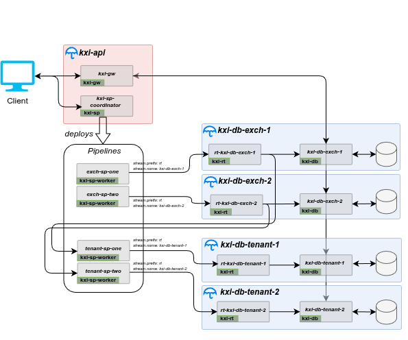

# Sharded Database Reference Architecture Chart

## Description

This reference architecture deploys a multi-database, multi-shard application. It offers the user a templated example of how to build a horizontally scalable database with Insights SDK Services. It utilizes data sharding to ensure ingestion and persistence can scale as the amount of data being ingested expands in line with business sectors and use cases.

## Architecture

The implementation consists of two umbrella charts:

- `kxi-api` - A common gateway umbrella chart comprising of the base `kxi-gw` and `kxi-sp` charts under `../../../kxCharts`
- `kxi-db-shard` - An instance of an InsightsDB comprising of a `kxi-db` and`kxi-rt` charts under `../../../kxCharts` as a single umbrella chart.



### kxi-api umbrella chart

The `kxi-api` umbrella chart has a single configuration file [kxi-api-values](config/kxi-api-values.yaml) which should be updated to align with licensing and any additional configuration necessary. Only one instance of this chart is required to be deployed for all databases and shards. This [file](config/kxi-api-values.yaml) should be reviewed and updated based on your configuration requirements.

### kxi-db-shard umbrella chart

The `kxi-db-shard` is a templated umbrella chart offering the user the ability to deploy as few or as many databases or shards with minimal configuration for new instances. This reference architecture consists of two databases (`exch` & `tenant`) each of which have two shards.

This requires two assembly files describing each database:

- [kxi-db-exch-assembly](config/kxi-db-exch-assembly.yaml) - The assembly configuration for the `exch` database
- [kxi-db-tenant-assembly](config/kxi-db-tenant-assembly.yaml) - The assembly configuration for the `tenant` database

Both databases require a single common configuration file used for consistent behavior across both databases. This should be reviewed and updated based on your configuration requirements. **NOTE:** Please ensure to set the `storageClassName` appropriately.

- [kxi-db-shard-values](config/kxi-db-shard-values.yaml) - A common configuration for all databases and all shards of the deployment

Each database shard has an independent configuration file detailing the specific configs for that shard, used both for ingestion and query:

- [kxi-db-exch-1-values](config/kxi-db-exch-1-values.yaml) - A minimal extension configuration file for the `exch` database shard 1
- [kxi-db-exch-2-values](config/kxi-db-exch-2-values.yaml) - A minimal extension configuration file for the `exch` database shard 2
- [kxi-db-tenant-1-values](config/kxi-db-tenant-1-values.yaml) - A minimal extension configuration file for the `tenant` database shard 1
- [kxi-db-tenant-2-values](config/kxi-db-tenant-2-values.yaml) - A minimal extension configuration file for the `tenant` database shard 2

## Running on Kubernetes

### Prerequisites

1. `helm` command installed on your local machine
1. A [Distributed storage solution](../../README.md#kubernetes-prerequisites) offering RWM access level. (Kubernetes docs for more [here](https://kubernetes.io/docs/concepts/storage/persistent-volumes/#access-modes))
1. Authentication details to Kx image repositories

    ```bash
    KX_USER=....
    KX_PASS=....
    KX_REGISTRY="portal.dl.kx.com"
    NAMESPACE="kxi-sdk"
    ```

1. `imagePullSecrets` setup on your cluster

    ```bash
    kubectl create secret docker-registry kx-pull-secret --docker-username=$KX_USER --docker-password=$KX_PASS --docker-server=$KX_REGISTRY -n $NAMESPACE
    ```

1. A license secret
    _Contact KX to get a license_

    ```bash
    LIC_FILE=./kc.lic
    kubectl create secret generic kx-license --from-file=license=$LIC_FILE -n $NAMESPACE
    ```

### Deploying

#### Deploying kxi-api

Review and update the sample configuration [`kxi-api-values.yaml`](config/kxi-api-values.yaml) based on your configuration requirements.

Deploy the chart:

```bash
# Run from '.../referenceArchitectures/kxi-sharded-databases directory

# Pull in dependencies
helm dependency build ./kxi-api

RELEASENAME=kxi-api # Unique name for this deployment
VALUESFILE=./config/kxi-api-values.yaml
NAMESPACE="kxi-sdk"
helm install $RELEASENAME ./kxi-api -f $VALUESFILE -n $NAMESPACE
```

#### Deploy `exch` InsightsDB

Plan to deploy an `exch` database containing two shards. Both shards use the common configuration (`kxi-db-shard-values.yaml`) along with a shard specific configuration (`kxi-db-exch-X-values.yaml`).

- **NOTE:** Please ensure to set the `storageClassName` appropriately in the `kxi-db-shard-values.yaml`

Each shard of both databases will be serviced by a RT message bus, and as detailed in the [kxi-rt chart](../../../kxCharts/kxi-rt/README.md#rt-streams-naming-conventions-and-discovery), the naming convention for each shard will be related to the release name used to deploy the chart below thus when prefixed with `rt-` deploy to `rt-$RELEASENAME`. Configuration for each shard RT stream is in the shard specific values files -  `kxi-db-exch-X-values.yaml`. The stream names are also illustrated in the architecture diagram.

Before we deploy the Database we need to copy the relevant assembly files to the `kxi-db` directory:

```bash
# Run from '.../referenceArchitectures/kxi-sharded-databases directory
cp -rf ./config/kxi-db-exch-assembly.yaml ../../../kxCharts/kxi-db
```

##### Shard one

To deploy the chart:

```bash
# Run from '.../referenceArchitectures/kxi-sharded-databases directory
# Pull in dependencies
helm dependency build ./kxi-db-shard

RELEASENAME_EXCH1=kxi-db-exch-1 # Unique name for this deployment
NAMESPACE="kxi-sdk"

VALUESFILE_COMMON=./config/kxi-db-shard-values.yaml
VALUESFILE_SHARD_EXCH1=./config/kxi-db-exch-1-values.yaml
helm install $RELEASENAME_EXCH1 ./kxi-db-shard -f $VALUESFILE_COMMON -f $VALUESFILE_SHARD_EXCH1 -n $NAMESPACE
```

##### Shard two

To deploy the chart

```bash
# Run from '.../referenceArchitectures/kxi-sharded-databases directory
RELEASENAME_EXCH2=kxi-db-exch-2 # Unique name for this deployment
NAMESPACE="kxi-sdk"

VALUESFILE_COMMON=./config/kxi-db-shard-values.yaml
VALUESFILE_SHARD_EXCH2=./config/kxi-db-exch-2-values.yaml
helm install $RELEASENAME_EXCH2 ./kxi-db-shard -f $VALUESFILE_COMMON -f $VALUESFILE_SHARD_EXCH2 -n $NAMESPACE
```

#### Deploy `tenant` InsightsDB

Plan to deploy a `tenant` database containing two shards. Both shards use the common configuration (`kxi-db-shard-values.yaml`) along with a shard specific configuration (`kxi-db-tenant-X-values.yaml`).

- **NOTE:** Please ensure to set the `storageClassName` appropriately in the `kxi-db-shard-values.yaml`

Before we deploy the Database we need to copy the relevant assembly files to the `kxi-db` directory

```bash
# Run from '.../referenceArchitectures/kxi-sharded-databases directory
cp -rf ./config/kxi-db-tenant-assembly.yaml ../../../kxCharts/kxi-db
```

##### Shard one

To deploy the chart

```bash
# Run from '.../referenceArchitectures/kxi-sharded-databases directory
# Pull in dependencies
helm dependency build ./kxi-db-shard

RELEASENAME_TENANT1=kxi-db-tenant-1 # Unique name for this deployment
NAMESPACE="kxi-sdk"

VALUESFILE_COMMON=./config/kxi-db-shard-values.yaml
VALUESFILE_SHARD_TENANT1=./config/kxi-db-tenant-1-values.yaml
helm install $RELEASENAME_TENANT1 ./kxi-db-shard -f $VALUESFILE_COMMON -f $VALUESFILE_SHARD_TENANT1 -n $NAMESPACE
```

##### Shard two

To deploy the chart

```bash
# Run from '.../referenceArchitectures/kxi-sharded-databases directory
RELEASENAME_TENANT2=kxi-db-tenant-2 # Unique name for this deployment
NAMESPACE="kxi-sdk"

VALUESFILE_COMMON=./config/kxi-db-shard-values.yaml
VALUESFILE_SHARD_TENANT2=./config/kxi-db-tenant-2-values.yaml
helm install $RELEASENAME_TENANT2 ./kxi-db-shard -f $VALUESFILE_COMMON -f $VALUESFILE_SHARD_TENANT2 -n $NAMESPACE
```

### Configuration changes

Upgrading and updating of configuration is executed using `helm upgrade`. This will deploy any changes made to the charts or configuration since the last deploy and automatically redeploy the latest to the application.

```bash
# Run from '.../referenceArchitectures/kxi-sharded-databases' directory
helm upgrade $RELEASENAME ./kxi-api -f $VALUESFILE -n $NAMESPACE
helm upgrade $RELEASENAME_EXCH1 ./kxi-db-shard -f $VALUESFILE_COMMON -f $VALUESFILE_SHARD_EXCH1 -n $NAMESPACE
helm upgrade $RELEASENAME_EXCH2 ./kxi-db-shard -f $VALUESFILE_COMMON -f $VALUESFILE_SHARD_EXCH2 -n $NAMESPACE
helm upgrade $RELEASENAME_TENANT1 ./kxi-db-shard -f $VALUESFILE_COMMON -f $VALUESFILE_SHARD_TENANT1 -n $NAMESPACE
helm upgrade $RELEASENAME_TENANT2 ./kxi-db-shard -f $VALUESFILE_COMMON -f $VALUESFILE_SHARD_TENANT2 -n $NAMESPACE
```

### Deploying Pipelines

To deploy pipelines initially we have to have access to the `kxi-sp` service to allow us access to the endpoint. This can be done via changing the `kxi-sp.service.type` in the values configuration to `NodePort` or `LoadBalancer` assuming the infrastructure supports those access points.
In this example we will port forward an access point

```bash
RELEASENAME=kxi-api
kubectl port-forward svc/$RELEASENAME-kxi-sp 5000:5000 -n $NAMESPACE &
```

#### Deploy `exch` pipelines

```bash
# Run from '.../referenceArchitectures/kxi-sharded-databases/spScripts' directory
#Define variables
PIPELINE_NAME=exch-sp-1
SPEC=trade_spec.q
./deploy-pipeline.sh $PIPELINE_NAME $SPEC
#curl -X POST "localhost:5000/pipeline/teardown/sp-$PIPELINE_NAME"
#Define variables
PIPELINE_NAME=exch-sp-2
SPEC=trade_spec.q
./deploy-pipeline.sh $PIPELINE_NAME $SPEC
#curl -X POST "localhost:5000/pipeline/teardown/sp-$PIPELINE_NAME"
```

#### Deploy `tenant` pipelines

```bash
# Run from '.../referenceArchitectures/kxi-sharded-databases/spScripts' directory
#Define variables
PIPELINE_NAME=tenant-sp-1
SPEC=position_spec.q
./deploy-pipeline.sh $PIPELINE_NAME $SPEC
#curl -X POST "localhost:5000/pipeline/teardown/kxi-api-$PIPELINE_NAME"
#Define variables
PIPELINE_NAME=tenant-sp-2
SPEC=position_spec.q
./deploy-pipeline.sh $PIPELINE_NAME $SPEC
#curl -X POST "localhost:5000/pipeline/teardown/kxi-api-$PIPELINE_NAME"
```

### Sample queries

To run some queries we have to have access to the `kxi-gw` service to allow us access to the endpoint. This can be done via changing the `kxi-gw.kxiSg.service.type` in the values configuration to `NodePort` or `LoadBalancer` assuming the infrastructure supports those access points.

However in this example we will port forward an access point.

```bash
kubectl port-forward svc/$RELEASENAME-kxi-gw-sg 5050:5050 -n $NAMESPACE &
```

Note in this example we will query the data with KDB and will require q to be [installed](https://developer.kx.com/products/kdb-x/install). Alternatively curl can be used per [kxi-ingest-persist](../kxi-ingest-persist/README.md#querying-data) & [kxi-ingest-transform-persist](../kxi-ingest-transform-persist/README.md#querying-data) examples.

```bash
# Run q
q
```

```q
//Connect
h:hopen 5050;

// Retrieve ad view metadata
res:h(`.kxi.getMeta;()!();`;enlist[`version]!enlist 3);
d:last res;
d`schema;
d`assembly;
d`api;
d`rc;
d`dap;
first d`api

// Get trade data from exch database shard 1
tableName:`trade;
database:`exch
shard:`one
startTime:.z.p - 1u;
endTime:.z.p;
res:h(`.kxi.getData;(`table`startTS`endTS`labels)!(tableName;startTime;endTime;`group`shrd!(database;shard));`;()!())

// Returns a table of trade data sorted by time for shard exch-one
`time xdesc last res
// Returns the number of points grouped by exch
select count i by exch from last res

// Get position data from tenant database shard 2
tableName:`position;
database:`tenant;
shard:`two;
startTime:.z.p - 1u;
endTime:.z.p;
res:h(`.kxi.getData;(`table`startTS`endTS`labels)!(tableName;startTime;endTime;`group`shrd!(database;shard));`;()!());

// Returns a table of position data sorted by time for shard tenant-two
`time xdesc last res
// Returns the number of points grouped by tenant
select count i by tenant from last res

// Retrieve data for exch database (all shards)
tableName:`trade;
database:`exch;
startTime:.z.p - 1u;
endTime:.z.p;
res:h(`.kxi.getData;(`table`startTS`endTS`labels)!(tableName;startTime;endTime;(enlist `group)!(enlist database));`;()!())

// Returns a table of data for the table trade across the exch database (both shards)
last res
// Returns the number of points grouped by exch
select count i by exch from last res

// Retrieve data for tenant database (all shards)
tableName:`position;
database:`tenant;
startTime:.z.p - 1u;
endTime:.z.p;
res:h(`.kxi.getData;(`table`startTS`endTS`labels)!(tableName;startTime;endTime;(enlist `group)!(enlist database));`;()!())

// Returns a table of data for position from the tenant database (both shards)
`time xdesc last res
// Returns the number of points grouped by tenant
select count i by tenant from last res
```

### Cleaning up

The `kxi-sharded-databases` reference architecture deployment can be deleted with helm as follows:

```bash
helm delete $RELEASENAME -n $NAMESPACE
helm delete $RELEASENAME_EXCH1 -n $NAMESPACE 
helm delete $RELEASENAME_EXCH2 -n $NAMESPACE 
helm delete $RELEASENAME_TENANT1 -n $NAMESPACE 
helm delete $RELEASENAME_TENANT2 -n $NAMESPACE 
```

By default the policy is to not delete associated volumes to allow it to be redeployed in the future and retain the data. If necessary these should be manually managed and deleted by the user.
